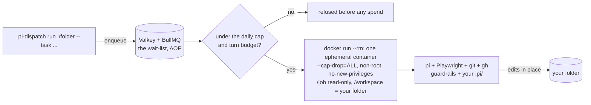
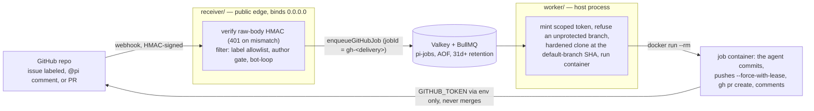
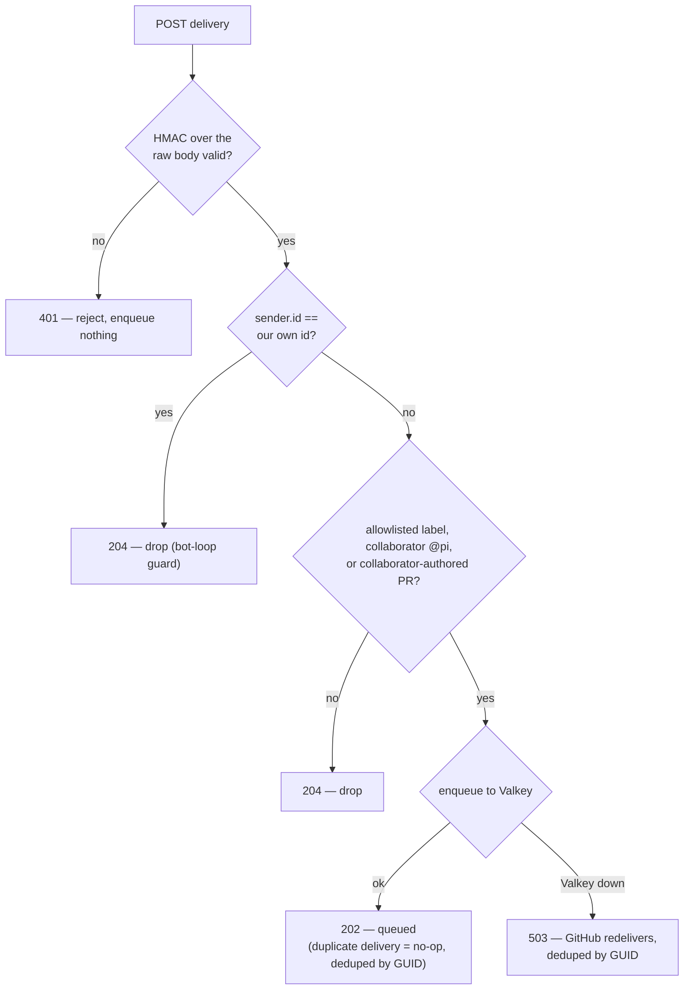

<p align="center">
  
</p>

# pi-dispatch

**Run the [pi](https://github.com/earendil-works/pi) coding agent as a service — triggered on demand, on a
cron schedule, or by a GitHub or GitLab issue, comment or pull/merge request — in a container you control, with a durable queue, a
spend cap, and a live admin panel.**


pi has no job queue, no concurrency control, no spend limit, and — by its own README — no permission
system. **pi-dispatch is exactly that missing operational layer, and nothing else.**

- **The container is the boundary.** Every job runs `--cap-drop=ALL`, non-root, ephemeral, instructions
  mounted read-only — pi's missing permission system, enforced by Docker.
- **Spend is bounded before a container starts** — a per-job turn budget and a daily cap, checked before
  a single token is spent.
- **And analyzed after.** Every run records which models spent what, and the dashboard's **COSTS view**
  turns that into verdicts: spend per flow/model/day, what a declared subscription actually saves
  against API rates, and what a flow *would* cost on another model — with every estimate visibly marked
  as one ([`docs/costs.md`](docs/costs.md)).
- **The image is yours to shape — per deployment, or per trigger.** Bake a project's toolchain into
  [`image/Dockerfile`](image/Dockerfile); it ships **Playwright + Chromium**, so a flow can build a frontend,
  screenshot it, and iterate on the rendered result — the edge over a fixed hosted routine or `/loop`. A
  trigger can name its own image with `run.image` when one flow needs Python and another needs Node
  ([`docs/job-image.md`](docs/job-image.md)).
- **Three triggers, one job.** A CLI command, a cron schedule, or a GitHub/GitLab issue, comment or
  PR/MR — same job, same box, same panel. Cron is the unattended one: recurring work on your own hardware, in an image you control —
  one per deployment, or one per trigger.
- **Your project steers it** — pi's native `.pi/skills` and persona, from your committed files, over a
  small immutable safety floor the agent can't remove.

## Quickstart (local folders)

You need **Docker** and **Node ≥ 22.19**, and a provider API key (e.g. Anthropic).

```bash
# 1. Get the job image — pull the prebuilt one (fast)...
docker pull ghcr.io/edgehero/pi-job:latest && docker tag ghcr.io/edgehero/pi-job:latest pi-job:latest
#    ...or bake your own toolchain in (slower, fully yours) — same tag, or a new one you point triggers at:
#    docker build -f image/Dockerfile -t pi-job:latest .

# 2. Start Valkey (the durable job queue)
docker compose -f deploy/docker-compose.yml up -d

# 3. Install, scaffold, and check your setup
npm ci
npx pi-dispatch init         # writes .env + triggers.json + pause-windows.json (never clobbers)
#    edit .env — set ANTHROPIC_API_KEY (or your provider's key)
#    already logged into pi? leave it blank — the worker reuses the key from ~/.pi/agent/auth.json by default
npx pi-dispatch doctor       # ✓/✗ preflight: Docker, Valkey, the images your triggers name, and your provider key

# 4. Run the worker in one terminal
npx pi-dispatch worker       # (or: npm --workspace worker start)

# 5. Queue a job from another
npx pi-dispatch run ./my-project --task "add type hints to utils.py" --flow tidy
```

> **The prebuilt image is a snapshot** of this repo's runner + guardrails at its build. To bake a project's
> toolchain in (the edge cron/visual flows rely on), build `image/Dockerfile` yourself — step 1's second form.
> And you can run **more than one**: `PI_JOB_IMAGE` is the deployment default, and any trigger may name its
> own with `run.image`. See [`docs/job-image.md`](docs/job-image.md).
>
> Either way, **pull or build it before you run**: jobs launch with `--pull=never`, so the worker never
> fetches an image at job time. A name it cannot find is refused *before* the job costs anything, rather than
> becoming a silent pull of whatever answers to that name in a registry. `pi-dispatch doctor` checks presence.

> **Heads-up on the CLI name.** `pi-dispatch` here is *this repo's* workspace CLI (`worker/src/cli.mjs`),
> which `npx` resolves from the local `node_modules/.bin` after `npm ci` — run these from the repo root. It
> is **not** the unrelated npm package `pi-dispatch` (see [License](#license)); this project isn't published
> to npm. If a shell can't find the local bin, use the explicit form:
> `node worker/src/cli.mjs run ./my-project --task "…" --flow tidy`.

The worker picks up the job, mounts your folder into a container, and pi edits it **in place**. It
refuses a dirty git working tree unless you pass `--force`, because there is no undo — point it at
folders you can restore, and commit first.

## What runs, and what protects you

The local path, end to end — the same queue, container, and budget every trigger flows through:



A container boundary, spend bounded *before* a container starts, nothing dropped — that is what this path
enforces. Read [`SECURITY.md`](SECURITY.md) before you rely on it: it states plainly what is and is not
defended.

**What the spend numbers cover.** Recorded tokens and cost are **process-wide**: they include every session
running inside the job's container, not just the top-level one — so a flow whose extension fans out into
subagent sessions is accounted in full, and the per-job token budget (`PI_MAX_TOKENS`) is enforced against
that same total. Two honest limits. `PI_MAX_TURNS` bounds only the **root** session's turns, because a
subagent session runs its own loop that the root's turn counter never sees. And a package that spawns a
**`pi` subprocess** is outside the container's Node process entirely and is **not metered** — its tokens are
spent and will not appear in the run record; the 30-minute container timeout is the backstop there, along
with the provider-side spend limit you should set anyway.

## Reuse your existing pi setup

Already run `pi`? Give every job your host setup — custom models, global skills, a global persona — **layered
under each repo's own `.pi/`** (the repo still wins). Works with the pulled image; it's a read-only mount, not
a rebuild — and it works the same in a per-trigger image, because a mount is a mount. What the overlay
**cannot** deliver is a **toolchain** (apt packages, a language runtime, system libraries); that is what
`run.image` and [`docs/job-image.md`](docs/job-image.md) are for.

**Continuing a conversation instead of starting one.** A follow-up job on a pull request is a cold start
by default: the agent re-explores the repo and re-derives what it decided an hour ago before it can act on
a two-line comment. `"resume": true` on a trigger makes its jobs continue the session that opened the pull
request instead. Off by default, on any trigger type, both forges — and it persists the agent's full
working history to disk, which is a real disclosure rather than a free win. Read
[`docs/sessions.md`](docs/sessions.md) before enabling it; it says who can be handed a transcript and what
it costs.

```bash
pi-dispatch import-pi          # stage a credential-free copy of ~/.pi/agent into ./pi-global
# then set PI_GLOBAL_PI_DIR=/abs/path/to/pi-global in .env, and:
pi-dispatch doctor             # verifies the overlay carries no credential
```

The overlay is mounted `/opt/pi-global:ro` into every container. Skills merge with the repo's (a repo skill
of the same name overrides the global one); the prompt layers `guardrails → global persona → repo persona`,
the safety floor always first and unremovable. `import-pi` **refuses** a `models.json` with a literal key and
**never** copies `auth.json` — your credential stays in the environment. Extensions come across **by
default** and `import-pi` prints each one it staged, since staging is the vetting step; pass
`--no-extensions` to skip them, or `PI_GLOBAL_ALLOW_EXTENSIONS=0` to keep them staged but dormant. The
admin extension is hard-blocked either way. Full reference:
[`docs/global-pi-overlay.md`](docs/global-pi-overlay.md).

**Third-party pi packages, pinned once and declinable per trigger.** Jobs run with no network, so a package
can't be installed at job time — declare it at an **exact** version in `pi-packages.json` and stage it into
the overlay on your host with `pi-dispatch import-pi --with-packages`. From then on every job gets it; set
`"packages": false` on any trigger that must run without it. Staging uses `--ignore-scripts` (a package's
lifecycle scripts would otherwise run **as you, on your host**), refuses a floating version or an
admin-shaped package name, and is all-or-nothing — a half-staged set would silently skip what didn't make
it. `pi-dispatch doctor` shows what is staged and which triggers have opted out.

**Already logged into pi? The key just works — by default.** When the provider key is absent from the
worker's environment, the worker reads it **host-side** from `~/.pi/agent/auth.json` and env-injects it into
the job — a host-side read of a host-held secret, never a file mounted into the container. Nothing to set;
`PI_AUTH_FROM_PI=0` forces env-only if you'd rather fail loudly on a missing env key. **API-key logins only**:
an OAuth/subscription login (`pi login`) is refused — those tokens expire and can't be refreshed in the
container, and a subscription isn't the credential for an unattended service; use an API key with a spend limit.

## Run as a service

`pi-dispatch worker` is a long-running process — run it in a terminal, or hand it to your OS's service
manager so it starts on boot and restarts on a crash. The units in [`deploy/`](deploy/) are **per-host
templates, not turnkey**: each carries `<PLACEHOLDER>` paths you fill in for your machine. The systemd
unit's *structure* is checked by `systemd-analyze`; the launchd and nssm units are worked examples. All
three run the worker on the **host** — it drives the `docker` CLI and is not itself containerised — so
they need the AOF-enabled Valkey from [`deploy/docker-compose.yml`](deploy/docker-compose.yml) running
alongside, which is what makes the queue **and the pause state** survive a reboot.

**Steer the running worker** without stopping it — these commands talk to Valkey, so they work whether the
worker runs in a terminal or under a service manager:

- `pi-dispatch pause` — stop taking new jobs. **Durable**: the pause lives in the queue and survives a
  worker restart, so a paused worker comes back paused after a reboot. Jobs still enqueue; they just wait.
- `pi-dispatch resume` — start taking jobs again.
- `pi-dispatch status` — prints `{ pausedState, waiting, active, paused, delayed, failed }`. `pausedState`
  is the switch; `paused` is the backlog **count** of jobs that piled up while paused (they land in the
  `paused` list, not `waiting`).

### Linux (systemd)

Edit [`deploy/worker.service`](deploy/worker.service): set `WorkingDirectory`, `EnvironmentFile`, `User`,
and the `node` path to your clone. Then install and start it:

```bash
sudo cp deploy/worker.service /etc/systemd/system/
sudo systemctl daemon-reload
sudo systemctl enable --now worker
```

`systemctl stop worker` sends **SIGTERM** — the worker stops accepting jobs and lets the in-flight
container drain before it exits.

### macOS (launchd)

Edit [`deploy/com.pi-dispatch.worker.plist`](deploy/com.pi-dispatch.worker.plist) and its wrapper
[`deploy/worker-env-wrapper.sh`](deploy/worker-env-wrapper.sh): set the repo-root and log paths (launchd
has no `EnvironmentFile`, so the wrapper loads `.env` at runtime). Then bootstrap it:

```bash
launchctl bootstrap gui/$(id -u) deploy/com.pi-dispatch.worker.plist
```

`launchctl bootout gui/$(id -u)/com.pi-dispatch.worker` sends **SIGTERM** for the same graceful drain.

### Windows (nssm)

Put `nssm.exe` on PATH ([nssm.cc](https://nssm.cc)), set `SERVICE` / `REPO` / `LOGDIR` in
[`deploy/nssm-install.cmd`](deploy/nssm-install.cmd), then run it and start the service:

```
deploy\nssm-install.cmd
nssm start pi-dispatch-worker
```

The wrapper [`deploy/worker-env-wrapper.cmd`](deploy/worker-env-wrapper.cmd) loads `.env` at runtime. A
console-stop (`nssm stop pi-dispatch-worker`) sends the worker a signal it handles, so it drains
gracefully.

### Drain before a planned restart

A planned restart should abort no in-flight job. Pause, wait for the queue to go idle, restart, then
resume:

```bash
pi-dispatch pause                     # stop taking new jobs (durable)
pi-dispatch status                    # repeat until "active": 0 — nothing in flight
sudo systemctl restart worker         # (or the launchctl / nssm equivalent)
pi-dispatch resume                    # take jobs again
```

Because the pause is durable, the worker comes back paused even if the restart outruns your `resume`, so
nothing slips through in the gap.

**Windows caveat**: stop the service with nssm's **console-stop** (`nssm stop`), which delivers a signal
the worker handles and drains gracefully. Task Scheduler is a weaker fallback — it stops a task with a
hard kill, giving the worker no chance to drain; a job killed mid-flight leaves a stray container that the
worker's **boot reaper** clears on the next start, rather than draining cleanly.

## Admin (pi extension)

The admin surface — the dashboard and command transcript shown at the top of this README — is a **pi
extension** in [`admin/`](admin/) that loads into *your own* interactive pi session — no daemon, no web
app, **no network port at all**.

**Install it through pi** — the published package (the extension **and** the `operate-pi-dispatch` skill, so
your AI can drive the deployment too — see [Operating pi-dispatch from your AI](#operating-pi-dispatch-from-your-ai)),
then open the panel:

```bash
pi install npm:@edgehero/pi-dispatch-admin   # then, in pi:  /dispatch
```

Two other ways to load it: from a clone, the in-repo `.pi/extensions` shim auto-loads once you've trusted
the project; or point pi at the source with `pi -e admin/src/index.ts` (add that path to the `"extensions"`
array in `~/.pi/agent/settings.json` to make it permanent). To operate a **live** deployment, give the pi
session the same `VALKEY_URL`, `PI_SETTINGS_FILE`, `PI_TRIGGERS_FILE`, `PI_PAUSE_WINDOWS_FILE`, and
`PI_LOGS_DIR` the worker uses — the panel reads and writes those same files and queue, so both act on one
deployment.

Bare `/dispatch` opens the live dashboard overlay — one snapshot per second, `p`/`r` to pause/resume the
queue in place, `↑`/`↓` to move across the triggers and runs, `Enter` to drill into either. **Triggers are
editable in place**: `Enter` on a trigger shows its trust model, `e` edits its flow, `x` deletes it, `a`
adds one (guided, kind-first), `s` edits a limit, and `w` manages scheduled pause windows — every write is
operator-typed, validated, atomic, and **reloaded live** by the worker/receiver (no restart). `Enter` on a
run opens its full PII-free record:


It adds `/dispatch` commands that run **locally, with no model involvement**:

- `status` — queue counts, paused state, budget; `budget` — today's spend against the daily cap
- `pause` / `resume` — the queue on/off switch
- `runs` / `logs` — recent run records, and one run's raw log
- `triggers` — the configured triggers (also editable from the overlay: `a`/`e`/`x`, applied live)
- `run <folder> <flow> [task]` — enqueue a flow against a local folder (operator-typed; the dirty-tree guard still applies)
- `settings` / `set <key> <value>` / `unset <key>` — the runtime overlay

`/dispatch pause|resume|status` are a second interface over the **same durable switch** as
`pi-dispatch pause|resume|status` (see **Steer the running worker** above), not a new mechanism; `runs`
and `logs` read the **same** `logs/<jobId>.json` / `.log` files as **Run history** below. The extension
reads only queue counts, run records, and the settings overlay — none of which carry credentials.

### Operating pi-dispatch from your AI

Installing `@edgehero/pi-dispatch-admin` gives your AI more than the panel: the package **also ships the
`operate-pi-dispatch` skill** (via its `pi.skills` manifest), so once it's installed your assistant knows this
deployment's tools and how to use their gates — **you can just ask, in plain language**: *"raise the daily cap
to 30", "add a nightly `tidy` trigger for `/srv/site`", "quiet-hours for `acme/web` 22:00–06:00 Amsterdam"*.
Everything the panel does is model-callable, so **setting it up can be driven entirely by the AI** — with your
confirmation on every change that costs money or config:

- **Read** (no confirm): `dispatch_status`, `dispatch_runs`, `dispatch_triggers`, `dispatch_pauses`.
- **Turn on/off** (no confirm — reversible, money-safe): `dispatch_pause` / `dispatch_resume`.
- **Change config — each behind a confirm you approve**: `dispatch_set` (a limit/setting), the triggers
  `dispatch_trigger_add` / `_edit` / `_delete`, and the quiet-hours `dispatch_pause_add` / `_edit` / `_delete`.
- **Start a paid run**: `dispatch_run` (gated — see below).

A confirm-gated write applies its change **only after you approve a dialog showing the exact before→after**,
and **refuses — writing nothing — when no interactive operator is present** (so a prompt-injected session
can't raise your cap or add a paid trigger; the model emits the call, only your keypress approves it). The
`operate-pi-dispatch` skill tells the model how to use those gates: state the change plainly, and accept a
decline. `CONST-BUDGET-BEFORE-TOKENS` and `CONST-TRIGGER-AUTHOR-GATE` are unchanged — the confirm is the human approval.

`dispatch_run` is the one model-callable tool that is **not money-safe**: unlike the others, it enqueues a
**PAID** agent run that edits a folder in place with **no undo** — and unlike the confirm-gated writes, it
has no operator confirm. It is bounded in blast-radius, not prevented, by **six** independent limits: the
folder allowlist `PI_DISPATCH_RUN_ROOTS` (realpath + containment); the committed per-flow
`ai-trigger: allow` opt-in read at HEAD (default **deny**); the dirty-tree refusal (no force option); no
spend-knob parameters on the tool; a per-hour rate limit; and the daily cap. Do not read it as money-safe
or reversible — it is neither. A raw `.log` is untrusted container output that renders in the overlay
viewer only, never into model context. Settings land in the `settings.json` overlay
(`PI_SETTINGS_FILE`; keys `model`, `provider`, `maxTurns`, `dailyCap`, `concurrency`) and take effect per
job — `concurrency` at the next pickup. The supported pi version is the pinned `0.80.7`; the load-time
capability probe is all-or-nothing and refuses loudly on any other version.

A flow becomes AI-triggerable only when its `.pi/skills/<flow>/SKILL.md` frontmatter sets
`ai-trigger: allow` (default **deny**); an AI trigger naming no such opted-in flow is refused.

A completed job can request follow-up flows by writing to a `/outbox` mount. The worker validates each
request host-side and enqueues **same-folder, local-parent only** (GitHub jobs never chain), gated by the
same `ai-trigger: allow` opt-in and bounded by `PI_CHAIN_DEPTH_MAX` and `PI_CHAIN_MAX_PER_JOB` — both
host-enforced, so the in-container agent controls nothing.

## Run history

The worker keeps a durable, per-job record under `PI_LOGS_DIR` (default: your OS temp dir,
`.../pi-dispatch/logs`). Every job writes an id-only status record `logs/<jobId>.json` — stable ids only
(the delivery GUID, `repo#number`), never issue or comment text. Set `PI_CAPTURE_JOB_LOGS=1` to **also**
capture the container's raw stdout/stderr to `logs/<jobId>.log`; this is **opt-in and off by default**,
because that raw stream can contain issue and comment text (PII). Both files stay host-side, are never
mounted into the job container, and are gitignored. A boot-time sweep prunes anything older than
`PI_LOG_RETENTION_DAYS` (default 30; `0` keeps them forever).

Each record also carries a per-(provider, model) **usage ledger** — which models spent what, cache split
included — which is what the dashboard's COSTS view (`c`), `/dispatch costs`, and the what-if re-pricing
fold over. Declare what your subscriptions cost in `subscriptions.json` (see
`subscriptions.example.json`) and the screen shows whether they are actually saving money; leave it out
and zero-rate runs honestly show `$0 (unrated)`, never "free". The whole story is in
[`docs/costs.md`](docs/costs.md).

## Re-open a finished run

The container is gone the moment a job exits, and stays gone. But the run's workspace is kept for a
short window, so you can start a **fresh** container on it and see what the agent actually built:

```bash
pi-dispatch sandbox --list                    # what is still re-openable, and for how long
pi-dispatch sandbox gh-12345 --publish 3000   # a shell in that run's workspace, app on 127.0.0.1:3000
```

Same image, same workspace, same isolation flags — and **no credentials**: no minted forge token, no
provider key. The agent is not running; you are. Bring your own auth if you need to push. From the admin
panel, press `b` on a run's detail screen.

Retention is on by default for 24 hours (`PI_SANDBOX_RETENTION_HOURS`; `0` turns it off) and swept at
worker boot. `--pin` keeps one run for `PI_SANDBOX_PIN_DAYS` (default 7) — bounded, never forever.
A retained directory holds the run's clone **plus its issue text**, so read `docs/sandbox.md` before
leaving it on.

## Flows: the custom prompt a trigger runs

A **flow** is the recipe the agent follows — a pi **skill** committed to the target repo/folder at
`.pi/skills/<flow>/SKILL.md`. **That file *is* the custom prompt**: the frontmatter names the flow, the body is
the standing instructions the agent runs. A trigger (or `pi-dispatch run --flow <name>`) only *names* which
flow to run; the flow lives with the project, so different repos can define the same flow name their own way.

```markdown
<!-- .pi/skills/tidy/SKILL.md -->
---
name: tidy
description: Format, fix lint, and tighten types across the repo.
ai-trigger: allow        # opt-in required for GitHub/AI triggers; omit for CLI/cron-only flows (default deny)
---

Run the formatter and linter and fix what they report; tighten obvious type holes.
Keep the diff minimal and open a PR titled "tidy: <what changed>". Do not change behavior.
```

Two things reach the agent: the **flow** (this SKILL.md — the standing instructions) and the **task** (the
one-off ask for a single run). You set the task explicitly for a CLI/cron run (`--task "…"`, or the trigger's
`task`); for a GitHub trigger the issue/comment/PR text *is* the task. Flows are read from your
**default-branch** commit, read-only — so **commit and merge a flow before a trigger can use it**; a PR branch
can neither add one nor alter it. `ai-trigger: allow` in the frontmatter is what lets a label/comment/PR — or
an AI tool — run that flow at all (default **deny**).

## Triggers: cron, labels, comments, pull requests

Every standing trigger — cron schedules and webhook triggers alike — lives in one unified
**`triggers.json`**, a list of `{ on, run }` pairs read by both the worker (cron) and the receiver
(GitHub, GitLab). Point both services at it with `PI_TRIGGERS_FILE`; the worker treats it as optional (unset =
cron off), the receiver requires it.

```jsonc
{ "triggers": [
  { "on": { "type": "cron", "id": "nightly", "pattern": "0 3 * * *" },
    "run": { "kind": "local", "folder": "/srv/site", "flow": "tidy", "task": "run the nightly tidy",
             "image": "pi-job:latest" } },
  { "on": { "type": "label", "any": ["pi:frontend"] },              "run": { "kind": "github", "flow": "frontend-fix" } },
  { "on": { "type": "comment", "phrase": "@pi" },                   "run": { "kind": "github", "flow": "fix" } },
  { "on": { "type": "pull_request", "action": ["labeled"], "any": ["pi:review"] }, "run": { "kind": "github", "flow": "review" } },

  { "on": { "type": "label", "any": ["pi:fix"] },                   "run": { "kind": "gitlab", "flow": "fix" } },
  { "on": { "type": "pull_request", "action": ["open", "update"] }, "run": { "kind": "gitlab", "flow": "review" } }
] }
```

The `on × run` matrix is the trust boundary, enforced fail-loud at load: a `cron` trigger must run
`local` (it has no webhook delivery, issue/PR number, or body), and every webhook trigger runs on a forge
— `github` or `gitlab`. `run.kind` picks the forge; the trigger types and label predicates are shared, but
the `pull_request` **actions** are each forge's own words (`labeled|opened|synchronize|reopened` vs
`open|update|reopen|approved`), and a word from the wrong forge is refused at load rather than left to
silently never match. See [`docs/gitlab.md`](docs/gitlab.md).

`"packages"` on any trigger's `run` (all four kinds) decides whether that trigger loads the third-party pi
packages you staged into the global overlay. It is an **opt-out**: staged packages load for every job, and
`"packages": false` is how one flow declines them. A non-boolean value is refused at load, and with nothing
staged the flag loads nothing either way; `pi-dispatch doctor` reports both cases.

`"image"` on any trigger's `run` (all four kinds) names the **container image** that trigger's jobs run in;
absent means the deployment default `PI_JOB_IMAGE`. It is how one flow gets a Python toolchain and another
gets Node + Playwright without one image carrying the union of both. **The image decides what is in the box,
never what the box can do**: whichever tag runs, it runs under the same `--cap-drop=ALL`, the same non-root
user, the same read-only `/job`, and the same closed env allowlist — all built by the worker, none of it
influenced by the image. Jobs launch with `--pull=never`, so **build or pull every image you name**; a name
this host does not have is refused before the job costs anything, and `pi-dispatch doctor` lists them all.
Like `packages`, it is deliberately **not** settable from the panel or by an AI tool — naming an image is an
edit to the reviewed `triggers.json`. See [`docs/job-image.md`](docs/job-image.md).

`"replicas"` on a **GitHub** `label`/`comment`/`pull_request` trigger's `run` (an integer `2` or `3`) races
that many sandboxes on the same event, independently, and lets you pick the better result. One labelled issue
becomes two containers, two branches (`pi/issue-7-r1`, `pi/issue-7-r2`) and **two pull requests**, each titled
`[r1/2]` / `[r2/2]`. Neither replica knows what the other did; that is the point. It is for the task that is
urgent enough that token cost has stopped mattering — **each replica reserves its own budget slot and spends
its own tokens**, so a `replicas: 2` trigger burns your daily cap twice as fast. Absent means what it always
meant: one delivery, one run. It is refused at load on cron/local triggers (a local job's workspace *is* your
folder — two replicas would edit one working tree), on GitLab/Forgejo/Azure for now, and alongside
`"resume": true`. Rebuild your job image before using it: an image that does not declare
`dev.pi-dispatch.capabilities=replicas` refuses replica jobs before they cost anything. Like `image` and
`packages`, it is a file edit only — no panel key, no AI tool. See [`docs/replicas.md`](docs/replicas.md).

### Add a trigger from the panel

You can edit `triggers.json` by hand, or add one from `/dispatch` without touching the file: press **`a`** and
answer the **kind-first** prompts. The panel writes a validated entry and both services reload it live:

- **cron** → `id` · `pattern` (5–6 field cron) · `folder` (absolute host path) · `flow` · `task`, then the
  optional `model` / `provider` / `maxTurns` (blank = the deployment default). Neither the panel nor
  `dispatch_trigger_*` can set `image`, `packages` or `replicas` — all three stay file edits; the panel shows
  them and edits the flow only. `replicas` is the sharpest case: a spend multiplier is exactly the kind of
  capability an AI assistant should not be able to grant itself.
- **label** → `labels` (space-separated, any-of) · `flow`. The issue text is the task.
- **comment** → trigger `phrase` (e.g. `@pi`) · `flow`. The comment/issue text is the task.
- **pull_request** → `action`s (`labeled opened synchronize reopened`) · `labels` (for `labeled`) · `flow`.

To change an existing trigger, `Enter` on it → **`e`** edits which flow it runs, **`x`** deletes it (with a
confirm). An AI assistant can propose the same edits via `dispatch_trigger_add`/`_edit`/`_delete`, but each
write waits on your confirmation.

### Scheduling recurring jobs

A cron trigger runs a local folder through a flow on a cron pattern — `pattern` is a 5- or 6-field cron
expression; `provider`, `model`, `maxTurns` and `image` are optional on `run` and fall back to the worker's
defaults. `"github": true` on `run` is also optional — it mints the same per-job GitHub token the webhook
path gets (injected as `GITHUB_TOKEN`/`GH_TOKEN`), so the flow can use `gh`; off by default. It names
GitHub explicitly — there is no cron opt-in for a GitLab token. A cron
`folder` is a **host path** — the worker runs on the host
([`DES-WORKER-ON-HOST`](specs/design.md)) and mounts that folder into the job container, so it must be
readable by the worker's user.

Every local job — cron, manual, or chained — also gets a read-only `/job/event.json` (`source:
cron|manual|chain`, the folder's basename, its HEAD sha; cron jobs additionally the trigger's id and
pattern, the scheduled-for instant, and the previous run's timestamp), so a scheduled flow can e.g. triage
only what changed since its last run. Comment-triggered GitHub jobs likewise now receive the invoking
comment in `event.json` and the prompt.

```bash
cp triggers.example.json triggers.json   # then edit the cron entry's "folder" to a REAL absolute path
# In .env:  PI_TRIGGERS_FILE=/absolute/path/to/triggers.json
npx pi-dispatch worker
```

Copying `triggers.example.json` verbatim makes the worker **refuse to start** with
`configError: folder does not exist` until a cron trigger's `folder` names a real path — fail-loud on
purpose, so a broken trigger never silently fails to fire.

## Quiet hours — scoped pause windows

Pause a **specific folder or repo's** runs *between certain times* — recurring daily, optionally restricted to
certain weekdays or a date range, in a timezone of your choice — and resume automatically. Unlike
`pi-dispatch pause` (which stops the **whole** queue, untimed), a pause window is per-scope and scheduled, and
a paused job is **deferred, not dropped**: it waits in the queue and runs once the window ends. The check
happens **before** the budget reservation, so a deferred job spends nothing and counts nothing against the cap.

Copy `pause-windows.example.json` and point `PI_PAUSE_WINDOWS_FILE` at it (unset = off); the worker validates
it at boot and live-reloads edits:

```json
{ "windows": [
  { "scope": "acme/web",  "from": "22:00", "to": "06:00", "tz": "Europe/Amsterdam",
    "days": ["mon","tue","wed","thu","fri"] },
  { "scope": "/srv/site", "from": "09:00", "to": "17:00", "dateFrom": "2026-08-10", "dateTo": "2026-08-14" }
] }
```

`scope` is a repo path (`"owner/name"`, or a nested GitLab `"group/sub/project"`), a local folder path, or `"*"` for all; `from > to` is an overnight window;
`days`/`dateFrom`/`dateTo` gate the day the window starts.

**Manage windows from the panel:** in `/dispatch`, press **`w`** and choose *Add*, *Edit*, or *Delete* —
validated and live, no restart.

- **Add** prompts `scope → from → to → tz → days → dateFrom → dateTo`; leave an optional field blank to omit it
  (blank `tz` = UTC, blank `days` = every day).
- **Edit** lets you pick a window and re-type only what changes — a blank answer keeps the current value.
- **Delete** picks a window and confirms.

The **PAUSES** pane shows each window as ● paused (with a resume countdown) or ○ open. Editing the file
directly and the confirm-gated `dispatch_pause_add`/`_edit`/`_delete` tools do the same thing. Full field
reference and more examples: **[`docs/pause-windows.md`](docs/pause-windows.md)**.

## GitHub automation

pi-dispatch can also be triggered by GitHub — label an issue, and a container works it on a fresh clone,
opens a PR, and comments back. A repo **webhook** drives it (set a `WEBHOOK_SECRET`), and the worker
authenticates to GitHub via `GITHUB_AUTH_SOURCE`: `gh` (a `gh auth token`) or a repo-scoped fine-grained
**PAT** by default. A GitHub **App is optional** — it buys stronger token scoping and is what you need
for multi-tenant. The `gh` source hands your full login scopes to every token-carrying job — `doctor`
warns and names them; use a fine-grained PAT or an App for per-job scoping. Which labels, comment
phrases, and pull_request actions fire which flow is configured in the same unified **`triggers.json`**
above; the receiver **requires** `PI_TRIGGERS_FILE`.



- Only a collaborator's label or `@pi` comment starts a job (the label *is* the approval step).
- Beyond labeled issues, pi-dispatch also handles **pull requests**: label a PR, comment on a PR, or fire
  automatically when a PR is opened or updated — the auto (`opened`/`synchronize`/`reopened`) path is
  gated on the PR author being a collaborator, so a fork PR from a stranger never auto-fires. A PR trigger
  just runs the configured flow; the flow (a repo skill) reviews, comments, or pushes to the PR via `gh`.
- The agent gets a **repo-scoped, short-lived token** — and, honestly: that token *can* merge, because
  GitHub gates push and merge behind the same `contents: write` scope. **Branch protection on your
  default branch is the real control**, so the worker **refuses** an unprotected repo. `SECURITY.md` has
  the detail.
- The checkout is always the base repo at its **default-branch SHA** — never a PR branch, even for a PR
  trigger. Because of that the repo's own `AGENTS.md` and `.pi/extensions` are loaded, as they would be in
  any `pi` run, which means **landing a commit on your default branch is enough to run code in a job
  container**. Issue and comment text is *not* in that category and never has been: it stays data in the
  user prompt. If you service repos you don't control, read the discovery section of `SECURITY.md` first.

Every delivery runs the same gate before anything is queued — the signature is checked over the raw bytes
*before* the body is parsed, and the `sender.id` bot-loop guard fires before the author check (so the
receiver's own comments, and the agent's own push to a PR head, can never re-trigger a job):



## GitLab automation

Same machinery, one new field. Point a GitLab webhook at **`/gitlab`** (`/` is the GitHub endpoint), set
`GITLAB_TOKEN` plus a verification mode, and write `"kind": "gitlab"` on your triggers.

```bash
GITLAB_TOKEN=glpat-xxxxxxxxxxxx        # a PROJECT access token, `api` scope, Developer or above
GITLAB_URL=https://gitlab.com          # your instance, if self-hosted
GITLAB_WEBHOOK_MODE=signature          # or `token` below GitLab 19.0
GITLAB_WEBHOOK_SECRET=whsec_...
```

Three things differ from the GitHub arm, and each is a correctness matter rather than a rename:

- **A GitLab label is not an approval.** A Guest can label an issue they are creating, and the minimum
  role for labelling varies by version and edition — so every GitLab trigger is gated on the actor's
  API-resolved project `access_level >= 30` (Developer), labels included.
- **Labels fire on the diff.** GitLab has no `labeled` event; a label add arrives as `update` with a
  before/after pair. Adding your label fires once; editing the issue afterwards fires nothing.
- **GitLab 17.4 or later.** Dedup uses GitLab's own retry-stable delivery id. An older instance is refused
  with a clear 400 rather than run on a key that would only half-dedup.

**Self-hosted works** — set `GITLAB_URL` and everything follows it, including `GITLAB_HOST` inside the job
container. A private CA needs `NODE_EXTRA_CA_CERTS` on the host and the cert in your job image; a
certificate failure names itself in the log rather than reporting a bare "fetch failed".

Full setup, the `api`-scope trade-off, and what is not supported: [`docs/gitlab.md`](docs/gitlab.md).

## How it compares

**vs the Claude Code GitHub Action.** For GitHub automation, often reach for the action —
[`anthropics/claude-code-action`](https://github.com/anthropics/claude-code-action) (MIT, ~8.4k stars) is
GA and does label-triggered issue automation for 10% of the effort. pi-dispatch is for a narrower case:
**you run pi, on your own hardware, and you want a real queue, a container boundary, and — the part the
action can't do — to run flows against local folders**, not just GitHub repos, without hosted-runner
minutes.

**vs Claude Code routines and `/loop`.** A routine runs a recurring agent task on a cron schedule (managed,
in the cloud); `/loop` repeats a prompt on an interval inside your session. For generic recurring work
they're simpler — nothing to host — and often the right call. pi-dispatch's cron trigger is the same idea
with a different centre of gravity: the run happens in **container images you build** — a different one per
flow, if that is what the work needs — on **your**
hardware, under **your** queue and spend caps. That is the edge when the task needs an environment a hosted
routine cannot give it — a project's exact toolchain and system libraries, or the baked-in **Playwright +
Chromium** that lets a scheduled flow build a frontend, screenshot it, and iterate until it renders right,
then attach the before/after to a PR. Rule of thumb: if the recurring task is *"run a prompt,"* use a
routine; if it is *"run this project's real build / test / visual loop on a schedule, in images I
control,"* that is this.

## Forgejo / Gitea automation

```bash
FORGEJO_URL=https://forgejo.example.com
FORGEJO_TOKEN=...            # repo-scoped: write:repository + write:issue
FORGEJO_BOT_ID=42            # required when the token is repo-scoped -- it cannot call GET /user
FORGEJO_WEBHOOK_SECRET=...
```

Point the webhook at **`/forgejo`**. Three things differ from the GitHub arm, and each is a correctness
matter rather than a rename:

- **Forgejo's transport is byte-compatible with GitHub's**, so `verify.mjs` is unmodified and delivery
  dedup transfers unchanged. This is the only forge of which that is true.
- **Actions are Forgejo's own words** — `label_updated`, `synchronized`. Against GitHub's vocabulary they
  fall out silently as an unhandled event, so the loader refuses the wrong forge's words at load.
  `label_cleared` fires nothing, ever.
- **Every trigger is gated on the actor's resolved repository permission** (`admin`/`write`), labels
  included — not because a Forgejo label is untrustworthy, but because we have not verified that it is.

Full setup, including the token scope trade-off: [`docs/forgejo.md`](docs/forgejo.md).

## Azure DevOps automation

```bash
AZURE_ORG_URL=https://dev.azure.com/your-org
AZURE_TOKEN=...              # a dedicated identity; needs vso.graph as well as code/work scopes
AZURE_WEBHOOK_MODE=basic     # required, deliberately not defaulted
AZURE_WEBHOOK_SECRET=...
```

Point the Service Hook at **`/azure`**, and read [`docs/azure-devops.md`](docs/azure-devops.md) before you
enable it — this is the weakest transport of the four, and the doc says exactly how:

- **No HMAC exists.** The credential proves the sender knew a secret and covers no bytes; there is no
  delivery-id header (the dedup key comes from the body) and no signed timestamp (so no replay window).
  `OQ-015` records the residual.
- **Tags are the label analogue, and the DIFF is the trigger.** Matching the current tag set would start a
  paid run on every later edit of a tagged work item.
- **A work item names no repository**, so an azure label/comment trigger must set `run.repository`.
- **Azure's CLI needs its own image.** Build `image/Dockerfile.azure` and name it with `run.image`; a
  trigger that forgets is refused *before* it costs anything.

## Status

The local-folder path (image, worker, `pi-dispatch run` / `worker`), the GitLab path (the same, for
issues, notes and merge requests), the GitHub path (receiver → queue →
clone → PR for both issues and pull requests), and scheduled (cron) triggers for local folders are built
and work; the worker runs in a terminal or as an OS service on Linux, macOS or Windows (see **Run as a
service**). The admin surface ships as a pi extension (see **Admin (pi extension)**). The design is
specified in [`specs/`](specs/) — start with [`specs/constitution.md`](specs/constitution.md) for the
non-negotiables and [`specs/design.md`](specs/design.md) for the decisions and what was rejected.

## Contributing

PRs welcome. Sign off your commits (`git commit -s`) — this project uses the
[DCO](https://developercertificate.org/), not a CLA. If you change behaviour, the spec changes with it:
`specs/` is the source of truth, and a PR that violates a `CONST-*` entry will be asked to justify the
constraint first, not the code.

## License

MIT. See [LICENSE](LICENSE). Built on [pi](https://github.com/earendil-works/pi) by Mario Zechner, which
does the actual hard part.

> **Not affiliated with** the unrelated npm package `pi-dispatch`, a pi extension for rotating ChatGPT
> Codex OAuth accounts. Same name, different thing — this project is not distributed via npm.
