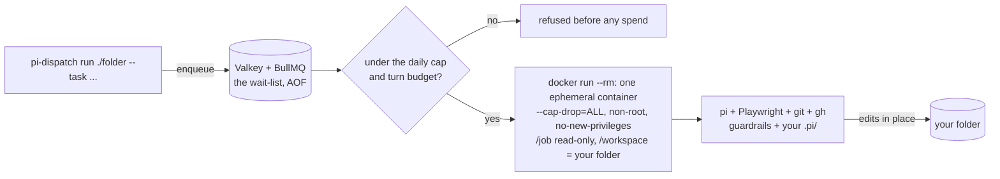
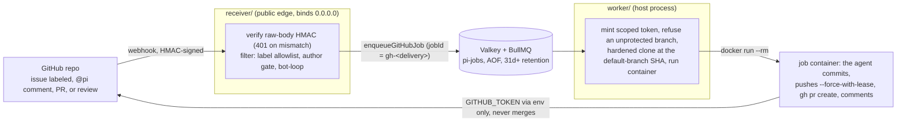

<p align="center">
  
</p>

# pi-dispatch

**Let a coding agent work on your repositories while you are not watching, without surprise bills and
without giving it the keys to your machine.** pi-dispatch runs the
[pi](https://github.com/earendil-works/pi) coding agent as a self hosted background service: on a
schedule, or when an issue, comment or pull request arrives from GitHub, GitLab, Forgejo or Azure
DevOps, it opens a locked down container, lets the agent do one job against the repo, records what it
did and what it spent, and shuts the container down. A durable queue absorbs bursts, spend caps are
checked before a single token is spent, and a live admin panel shows everything and can turn the whole
thing off. This is not another agent to weigh against the one you already use; it is the queue, the
budget and the box for the pi you already run, steered by the `.pi/` setup your repo already has.


pi itself is a superb agent with no job queue, no concurrency control, no spend limit, and, by its own
README, no permission system. pi-dispatch is exactly that missing operational layer, and nothing else:

- **The container is the boundary.** Every job runs `--cap-drop=ALL`, non-root, ephemeral, with its
  instructions mounted read-only. That is pi's missing permission system, enforced by Docker.
- **Spend is bounded before a container starts**: a per-job turn budget plus daily, weekly and monthly
  caps, checked before a single token is spent. And analyzed after: the insights page shows spend
  per flow, trigger, model, day and repo, what a subscription actually saves, what a flow would
  cost on another model, and the budget dials themselves ([`docs/costs.md`](docs/costs.md)).
- **The image is yours to shape.** Bake a project's toolchain into [`image/Dockerfile`](image/Dockerfile);
  it ships Playwright and Chromium, so a flow can build a frontend, screenshot it, and iterate on the
  rendered result. Any trigger can name its own image with `run.image`
  ([`docs/job-image.md`](docs/job-image.md)).
- **Three ways in, one job.** A CLI command, a cron schedule, or a forge event: same queue, same box,
  same panel. The full trigger reference is the [next section](#triggers).
- **Your project steers it** through pi's native `.pi/skills` and persona, from your committed files,
  over a small immutable safety floor the agent cannot remove.

## When to use it

Reach for pi-dispatch when the work is **recurring or event driven**, the kind of agent loop you want
running without you:

- a nightly job that triages new issues, updates a report, or tidies a backlog;
- "label an issue `ai` and a fix PR appears", for your team's everyday small fixes;
- a follow up loop that answers review comments on the PRs the agent itself opened;
- several repos and several such loops, sharing one queue, one budget, one panel.

On a forge you stay in the loop at both ends: a job starts only when someone with write access to
the repo asks for one, by a label, an `@pi` comment or a review, and what comes back is a pull
request you review and land, because pi-dispatch never merges anything, not on green CI, not on any
condition ([the details](#github-automation)). What it removes is the terminal babysitting, not you.

For a one off interactive session on your own machine, plain pi is enough; pi-dispatch earns its keep
the moment an agent runs while nobody is watching the terminal.

Running agents this way is a design, observe, tune loop (some call it workflow or context engineering;
here it is just how the pieces fit). You **design** loops as triggers plus committed skills; the
**graph** shows the loops you actually built (what triggers what, what chained to what, where a skill's
own text says it might loop, [`docs/graph.md`](docs/graph.md)); and **insights** prices them (what each
trigger and flow costs, whether a subscription pays off, drawn as charts beside that same topology,
[`docs/insights.md`](docs/insights.md)). One `/dispatch insights` gives you the whole picture as a
single file your browser opens from disk, budget dials included, because the caps are the one lever
that actually changes what all of this costs:


## Quickstart

You need **Docker**, **Node 22.19 or newer**, and a provider API key (Anthropic, OpenAI, and about 30
others).

### From pi (the default route)

You already run pi, so let the console do everything:

```bash
pi install npm:@edgehero/pi-dispatch-admin   # then, inside pi:  /dispatch
```

With nothing configured, `/dispatch` takes you straight into guided setup: it creates a deployment
folder, installs the pinned runtime, runs the same consented `up` pass described below in your
terminal, optionally installs the worker as a service and the receiver as your trigger edge, and lands
you in the admin panel, with an optional first trigger for the repo you are sitting in. Every step
shows what it will do, asks first, and can be declined; nothing is written into your repo and no
credential passes through a dialog.

### Servers and headless

The same setup as plain commands. No clone needed:

```bash
mkdir my-dispatch && cd my-dispatch
npx @edgehero/pi-dispatch up   # one consented pass: pulls the job image, starts Valkey,
                               #   scaffolds the config files, runs the doctor preflight.
                               #   Every docker action shows its command and asks first.
#  edit .env and set your provider key. Already logged into pi with an API key? Leave it blank.

npx @edgehero/pi-dispatch worker                                          # terminal 1: drain the queue
npx @edgehero/pi-dispatch run ./my-project --task "add type hints" --flow tidy   # terminal 2: first job
```

The worker mounts your folder into a container and pi edits it **in place**. It refuses a dirty git tree
unless you pass `--force`, because there is no undo. Commit first.

Prefer a clone? Same commands, unbundled (`git clone` + `npm ci`, then `npx pi-dispatch init`, `doctor`,
`worker`). A clone is required for one thing only: **building a custom job image**, since the Dockerfile
needs this repo as build context. Jobs launch with `--pull=never`, so pull or build every image before
you run; a name the host does not have is refused before the job costs anything.

> **Naming heads-up.** The published package is scoped: `@edgehero/pi-dispatch` (bin `pi-dispatch`). The
> bare npm name `pi-dispatch` belongs to an unrelated package (see [License](#license)), so outside a
> checkout always use the scoped form.

## Triggers

**This is what starts a job.** Everything further down is the box those jobs run in and the panel you watch
them from. All standing triggers live in one `triggers.json`, read live by the worker (cron) and the
receiver (forges), and editable from the panel:

```jsonc
{ "triggers": [
  { "on": { "type": "cron", "id": "nightly", "pattern": "0 3 * * *" },
    "run": { "kind": "local", "folder": "/srv/site", "flow": "tidy", "task": "run the nightly tidy" } },
  { "on": { "type": "label", "any": ["pi:frontend"] },              "run": { "kind": "github", "flow": "frontend-fix" } },
  { "on": { "type": "comment", "phrase": "@pi" },                   "run": { "kind": "github", "flow": "fix" } },
  { "on": { "type": "pull_request", "action": ["labeled"], "any": ["pi:review"] }, "run": { "kind": "github", "flow": "review" } },
  { "on": { "type": "label", "any": ["pi:fix"] },                   "run": { "kind": "gitlab", "flow": "fix" } }
] }
```

### The four trigger types: what fires each one, and what it runs

pi-dispatch is the trigger layer. Every entry is one `{ on, run }` pair: **`on` is what fires it**, and
**`run` is what it runs**, either a flow or a registered command (`flow` names a `.pi/skills/<flow>` in
the target repo: see [Flows](#flows-the-custom-prompt-a-trigger-runs) for what that file is, and
[Multi-stage workflows](#multi-stage-workflows-and-third-party-pi-extensions) for chaining skills or
staging a workflow extension).

| `on.type` | Fires on | Required in `on` | What narrows it | What the agent gets as its task |
|---|---|---|---|---|
| `cron` | your schedule | `id` (unique, no `:`) · `pattern` (5 or 6 cron fields) | nothing: a schedule is its own condition | `run.task`, written in the file |
| `label` | a label on an **issue** (or an Azure work item), never a pull request | at least one positive selector, `any` or `all` | the label **predicate**: `any` (any of these) · `all` (all of them) · `none` (suppress-only, it can prevent a fire but never cause one) | the issue title and body |
| `comment` | a comment containing your phrase | `phrase`, for example `@pi` | the phrase, and **one comment trigger per forge** | the comment body plus the issue title and body |
| `pull_request` | a PR or MR event, including a submitted GitHub review | `action`, a non-empty array in your forge's own words | `action`, plus the same label predicate; where the forge has a label action and you name it, a positive selector becomes **required**; on a GitHub review, also `reviewState` | the PR title and body, plus the review body when a review fired it |

One variation changes that last column for every type: a trigger that names `run.command` instead of
`run.flow` gives the agent exactly `/command args` as its whole prompt, and the issue, comment or PR text
waits in `/job/event.json` for the command's handler to read (see
[Multi-stage workflows](#multi-stage-workflows-and-third-party-pi-extensions)).

Every type also needs `run.kind` (`local` for cron, else the forge) and exactly one of `run.flow` or
`run.command` (naming both, or neither, refuses to load in both services). Cron additionally
needs `folder` (a host path the worker checks exists when it loads the file; make it absolute, since a
relative path resolves against the worker's own directory) and, with `flow`, a `task`. Azure `label` and
`comment` triggers need `run.repository`, because a work item belongs to a project and names no repository.

Two matching behaviours worth knowing before you arm a paid trigger:

- **A comment can choose the flow.** `<phrase> <flow>` in the comment body overrides the trigger's
  `run.flow` whenever that word matches another trigger's flow in the same file, so `run.flow` is a
  default rather than a fixed pairing. On a rule that names `run.command` this channel is inert: trailing
  words never retarget or suppress the command, and reach the job only as data in `/job/event.json`.
- **Label triggers match differently per forge.** GitHub and Forgejo match the issue's **whole current
  label set**, so reopening an already-labelled issue, or adding an unrelated label to one, fires
  again. GitLab and Azure match only the labels **that event added**, which is exactly why they do not
  re-fire that way.

`action` words are each forge's own vocabulary, validated at load so a word from the wrong forge is
refused rather than silently never matching:

| `run.kind` | `pull_request` actions | Its label action | Notes |
|---|---|---|---|
| `github` | `labeled` `opened` `synchronize` `reopened` `review_submitted` | `labeled` | `review_submitted` is the `pull_request_review` event's `submitted` action, so a formal Approve or Request changes starts a job. It is gated on the **reviewer's** permission, never the PR author's, so a collaborator reviewing a stranger's fork PR runs and a stranger reviewing their own PR does not |
| `gitlab` | `open` `update` `reopen` `approved` | none | a label add arrives as `update` carrying a label diff; a predicate here matches the labels that update added. `approved` is one verdict where GitHub's `review_submitted` is every verdict |
| `forgejo` | `label_updated` `opened` `synchronized` `reopened` | `label_updated` | `label_cleared` fires nothing, ever: removing a label must never start a paid run |
| `azure` | `created` `updated` | none | a label predicate on an Azure PR is refused at load: Azure tags work items, never pull requests |

**A review trigger is wider than it looks, so narrow it.** `review_submitted` fires on every submitted
review: an Approve, a Request changes, and a one word "lgtm thanks" alike. Unlike a comment trigger there
is no phrase in the way and unlike a label trigger there is no label, so arming it means anyone with write
access starts a paid run by reviewing. Add `reviewState` (GitHub only, and only beside `review_submitted`)
to pick the verdicts worth paying for:

```jsonc
{ "on": { "type": "pull_request", "action": ["review_submitted"], "reviewState": ["changes_requested"] },
  "run": { "kind": "github", "flow": "address-review" } }
```

Two behaviours to know before you arm it. A **Comment** type review whose remarks are all line comments
and whose summary box is empty starts nothing, because those remarks arrive on an event this service does
not read, so the review reaches us empty; Approve and Request changes still fire with an empty summary,
since there the verdict is the signal. And the bot loop guard knows only **our own** identity, so another
bot that reviews (a CI bot, a review service) can start jobs if it holds write access. [`SECURITY.md`](SECURITY.md)
states both, and the flow gets `review.id` in `/job/event.json` so it can fetch the line comments itself.

**Who may fire a trigger is not ours to grant.** Your forge decides that, differently per forge, and
[`SECURITY.md`](SECURITY.md) states each one plainly (short version: on GitHub only collaborators can
apply a label, which is why the label *is* the approval there; GitLab, Forgejo and Azure resolve the
actor's permission through their APIs because a label proves less on those). The always-on gates that
every delivery passes, none of them per-trigger, are the signature check, the bot-loop guard, that
permission check, dedup, quiet hours, the image preflight, branch protection, and the spend caps.

### Optional `run` fields

Each is a deliberate file-only edit (no panel key, no AI tool, because each one changes what code runs
or what it costs):

- `"command"` replaces `flow` (exactly one of the two, on any trigger type): the job dispatches a
  registered pi extension command headlessly, its whole prompt being `/command args`. Arguments are fixed
  in the reviewed file; the event text reaches the handler only as `/job/event.json`, which it reads
  itself. A command is never AI-triggerable: job chaining refuses any request naming one, and
  `dispatch_run` cannot express one ([`docs/workflows.md`](docs/workflows.md)). The job image must declare
  the `commands` capability (the shipped image does); a command job on an image that does not is refused
  before it costs anything.
- `"image"` names the container image for that trigger's jobs; absent means `PI_JOB_IMAGE`. The image
  decides what is in the box, never what the box can do: the isolation flags are the worker's, always
  ([`docs/job-image.md`](docs/job-image.md)).
- `"packages": false` opts one trigger out of the staged third-party pi packages, which is also how a
  workflow extension is withheld from one flow ([`docs/workflows.md`](docs/workflows.md)).
- `"skillsDir"` points at a directory of skills on the worker host, in the same `<name>/SKILL.md` layout
  as your own `~/.pi/agent/skills`. They are copied into that trigger's jobs and layered under the repo's
  own `.pi/skills` and over the global overlay, so a repo skill of the same name still wins. Use it to run
  a flow against a repo that has not adopted `.pi/skills/` at all, to A/B two versions of a flow across two
  triggers, or to keep a private flow out of a public repo's history
  ([`docs/global-pi-overlay.md`](docs/global-pi-overlay.md)).
- `"replicas": 2` (GitHub only) races independent sandboxes on the same event and opens one PR per
  replica. Each replica spends its own budget slot ([`docs/replicas.md`](docs/replicas.md)).
- `"instructions"` attaches one line of standing text to that trigger (forge triggers only, up to 2000
  characters). It reaches the job's prompt above the issue or PR text, labelled as coming from you rather
  than from the issue, so "the tests run with pnpm here" applies to every run of that trigger without
  being committed to the repo or pushed into the deployment wide persona. Cron triggers use `task`
  instead, which is the same text in the same place.
- `"resume": true` continues the session that opened the PR ([`docs/sessions.md`](docs/sessions.md)).
- `"github": true` on a cron trigger mints the same per-job GitHub token the webhook path gets, so a
  scheduled flow can use `gh`.

Everything else is editable from the panel (`a` adds kind-first, `e` edits the flow, `x` deletes) or via
the confirm-gated AI tools; every write is validated and both services reload it live. Every local job
also receives a read-only `/job/event.json` (source, folder, HEAD sha; cron adds its id, pattern and
schedule instants), so a scheduled flow can triage only what changed since its last run.

### Quiet hours

Pause a specific repo or folder between certain times (recurring, weekday- or date-bounded,
timezone-aware) and resume automatically. A paused job is deferred, never dropped, and spends nothing:

```json
{ "windows": [
  { "scope": "acme/web", "from": "22:00", "to": "06:00", "tz": "Europe/Amsterdam", "days": ["mon","tue","wed","thu","fri"] }
] }
```

Manage them with `w` in the panel or `PI_PAUSE_WINDOWS_FILE` by hand
([`docs/pause-windows.md`](docs/pause-windows.md)).

## Flows: the custom prompt a trigger runs

A **flow** is a pi skill committed to the target repo at `.pi/skills/<flow>/SKILL.md`. That file is the
custom prompt; a trigger only names which flow to run, so different repos define the same flow name their
own way:

```markdown
<!-- .pi/skills/tidy/SKILL.md -->
---
name: tidy
description: Format, fix lint, and tighten types across the repo.
ai-trigger: allow        # opt-in for AI-INITIATED runs only (the dispatch_run tool, job chaining). Default deny.
---

Run the formatter and linter and fix what they report; tighten obvious type holes.
Keep the diff minimal and open a PR titled "tidy: <what changed>". Do not change behavior.
```

The flow is the standing instructions; the **task** is the one-off ask (your `--task`, a trigger's
`task`, or the issue/comment text itself). Flows are read from the **default branch**, so commit and
merge a flow before a trigger can use it. That merge is the repo's consent.

**A skill arrives whole.** Ship `references/`, templates or scripts beside your `SKILL.md` and they are
copied into the job container with it, so a relative path in your skill resolves to a file that is
actually there. Three limits worth knowing. Scripts arrive **non executable**, because everything under
`/job` is read only, so invoke them as `bash scripts/build.sh` rather than `./scripts/build.sh`. Files
whose names begin with a dot are skipped, matching pi's own loader. And a skill directory is bounded (256
files, 8 MiB, 1 MiB per file, 4 levels deep): a repo past any of those refuses its jobs with a reason
naming the cap, before spending anything, rather than quietly copying part of the skill.

**`ai-trigger` gates a different axis, and it is worth being precise about which.** It answers *which
flows a model may fire*, not *who may fire a job*. Only two paths read it: the model-callable
`dispatch_run` tool and job chaining (a finished job requesting a follow-up). A cron entry or a forge
trigger in your reviewed `triggers.json` runs its named flow whether or not the frontmatter carries the
line, because a human already approved that pairing by writing the file. Omitting the line does **not**
stop a label or comment trigger from firing. Who may fire a forge trigger is a separate gate entirely,
described under [Triggers](#triggers) above.

### Multi-stage workflows, and third-party pi extensions

A flow is one skill, and a skill may call other skills, so the simplest workflow here is just that chain
running inside one job. For something more structured, **pi extensions stage into the deployment and load
in every job container**, pinned to an exact version and present offline.

**How a workflow gets triggered: nothing new fires it.** The chain is always the same, and every stage
runs inside the one job the trigger produced:

```text
label / comment / PR / cron  ->  one job, one container  ->  run.flow | run.command  ->  the skills it calls,
                                                                                         or a workflow extension
```

Four basics follow from that shape:

- **`run.flow` and `run.command` are the two entry points.** A trigger names a flow or a registered
  command, never a workflow. In a flow job, which stages run is decided inside the job by that skill; in a
  command job, the named command dispatches directly, with its arguments fixed in the reviewed file.
- **A job is not an interactive session.** The container hands pi one assembled prompt and reads the exit
  line. That one prompt can be a slash command: `"command": "wf"` on a trigger dispatches a workflow
  extension's `/wf` (in the example below) exactly as a typed one would, with no model turn in between. In
  a flow job a workflow starts because the flow's instructions drive it, or because you also staged a small
  extension that calls the workflow API from a lifecycle hook.
- **One trigger is one job, one budget slot, one turn budget.** Ten stages share the same `PI_MAX_TURNS`
  and the same per-job token budget; exhausting either aborts the job as a policy refusal that is never
  retried. Budget for the whole chain, not per stage.
- **Whether state survives depends on the trigger kind.** A cron or CLI job has your folder mounted
  read-write, so a workflow's own state persists between runs. A forge job gets a fresh clone, so it does
  not.

Staging is the setup, and it happens once on the host. If you already installed the package in pi, that is
the whole setup: the stager finds it and pins the exact version your host has.

```bash
pi install npm:@juicesharp/rpiv-workflow
pi-dispatch import-pi --with-packages   # installs on the host, always --ignore-scripts, into ./pi-global/packages/
```

Declaring a package by hand is still available, for pinning a version different from your host's, or for one
your host does not have. An entry here wins over what was discovered:

```jsonc
// pi-packages.json (optional)
{ "packages": [ { "name": "@juicesharp/rpiv-workflow", "version": "2.4.0" } ] }
```

That example is a real pi extension: it chains skills into typed multi-stage workflows with per-stage
output validation and append-only JSONL state. pi-dispatch does not integrate it specially, and that is
the point. **Any package whose `package.json` carries a `pi` manifest stages the same way**, and one
staged directory can contribute extensions, skills, prompts and themes at once.

What the deployment provides is the plumbing and the limits: no network at job time (so nothing installs
inside a job, which is why staging exists), exact versions only, package code loaded **last** so it can
never shadow your repo's own skills, any extension that tries to register a `dispatch_*` tool dropped,
and `"packages": false` on any trigger that must not load it. Every package is printed by name with where it
came from, because that list is the moment to vet what will run in every job.

Where a workflow's own state lives is the part worth reading before you build on it, because it differs
between a cron job and a forge job: [`docs/workflows.md`](docs/workflows.md).

## What runs, and what protects you



Every trigger flows through this same path: a container boundary, spend checked before the container
starts, nothing dropped. Read [`SECURITY.md`](SECURITY.md) before you rely on it; it states plainly what
is and is not defended. Recorded tokens and cost are process-wide (subagent sessions included), and the
per-job token budget is enforced against that same total.

## Reuse your existing pi setup

Give every job your host pi setup (custom models, global skills, a persona), layered under each repo's
own `.pi/`. The repo always wins on conflict:

```bash
pi-dispatch import-pi   # stage a credential-free copy of ~/.pi/agent into ./pi-global
                        # then set PI_GLOBAL_PI_DIR in .env; doctor verifies it carries no credential
```

Three properties worth knowing, each with a full reference:

- **Credentials never enter the overlay.** `import-pi` refuses a `models.json` with a literal key and
  never copies `auth.json`. When the worker's env has no provider key, it reads your API key host-side
  from `~/.pi/agent/auth.json` and injects it per job. OAuth and subscription logins are refused; an
  unattended service needs an API key with a spend limit
  ([`docs/global-pi-overlay.md`](docs/global-pi-overlay.md)).
- **Third-party pi packages are pinned once, declinable per trigger.** `import-pi --with-packages` stages
  what you installed with `pi install`, at the exact version your host has, plus anything you pinned by hand
  in `pi-packages.json` (always `--ignore-scripts`). Opt any trigger out with `"packages": false`, and use
  `--no-host-packages` to stage only what you declared. This is also how a workflow extension reaches a job
  ([`docs/workflows.md`](docs/workflows.md)).
- **What a repo declares is never installed.** A serviced repo's `.pi/extensions` do run, because the
  checkout is the default branch and merging is the gate, but nothing installs packages on a repo's say so:
  that would put third party install time code next to a live forge token
  ([`SECURITY.md`](SECURITY.md)).
- **Sessions can continue instead of restarting.** `"resume": true` on a trigger makes follow-up jobs
  continue the session that opened the pull request. It persists the full transcript to disk, which is
  a real disclosure: read [`docs/sessions.md`](docs/sessions.md) before enabling it.

## Run as a service

```bash
pi-dispatch service render    # show the unit it would install: real node path, real repo root
pi-dispatch service install   # user-level: LaunchAgent (macOS) / systemctl --user (Linux) / nssm (Windows)
pi-dispatch service status    # which unit exists, in which scope, and whether it is running
pi-dispatch service restart --drain   # pause, wait until nothing is in flight, restart, resume
```

`install` renders the [`deploy/`](deploy/) templates and installs without sudo (`--system` on Linux
prints the sudo commands instead of running them; `--receiver` installs the receiver unit when the
receiver package is installed alongside). Units anchor on your deployment folder: `WorkingDirectory`
and `.env` point at the folder you run the command from, and the exec paths point at the installed
package, so the same command is correct from a checkout and from an npm install. It refuses a second worker unit in another scope: one worker per docker daemon, because
the boot reaper would treat the other's containers as strays. Honesty notes: on macOS and Windows the
service is login-scoped, because Docker Desktop is; and a policy refusal (exit 2) never relaunches, on
any OS, so no supervisor loops against a paid provider. The templates remain hand-editable examples if
you prefer to adapt them directly.

Steer the running worker without stopping it, from any terminal:

- `pi-dispatch pause` stops taking new jobs. Durable: it lives in the queue and survives restarts.
  Jobs still enqueue; they wait.
- `pi-dispatch resume` takes jobs again. `pi-dispatch status` prints the counts.

## The admin panel

The dashboard shown at the top of this README is a **pi extension**: it loads into your own interactive
pi session. No daemon, no web app, no network port. Analytics live on the insights page: pressing `i`
(or typing `/dispatch insights`) writes one self contained file and opens your browser (still no
server and no port), with the whole trigger and flow topology drawn Node-RED style, what triggers
what, what chained to what in the recorded runs, what a skill's own text says it might chain to,
orphan skills and dangling triggers flagged, each cron's next fire or overdue state, and spend badged
onto the triggers that earned it ([`docs/graph.md`](docs/graph.md) explains every edge;
[`docs/insights.md`](docs/insights.md) the page, shown [above](#when-to-use-it)).

![The topology pane of the insights page: cron and forge triggers wired to their flows across the four skill tiers (repo, injected, overlay, staged package), a /wf command trigger with no flow edge, an amber not-at-HEAD flow, an observed chain edge carrying its run count and recency, a potential mention, a skill with its prose loop grouped inside it, cron re-arm loops with their schedules, an orphan skill dimmed, the forge group naming the repos its runs hit, and the legend stating the chain caps and honesty counters](docs/images/graph-view.png?v=1.0.0)

```bash
pi install npm:@edgehero/pi-dispatch-admin   # then, in pi:  /dispatch
```

**No deployment yet? The console builds one.** When `/dispatch` finds nothing (no config, no env, queue
unreachable) it takes you straight into **`/dispatch setup`**, described in the Quickstart above: an
opening choice, a deployment folder, the pinned runtime, a Docker check, `pi-dispatch up` in your
terminal, an optional worker service, an optional trigger edge (receiver service, compose profile, or
the polling command), and an optional first trigger for this repo. Every step asks first and can be
declined; nothing is written into your repo, and no credential passes through a dialog. Setup writes a
small **deployment pointer** (`~/.pi/agent/pi-dispatch-deployment.json`, paths only, never credentials)
so the panel finds the deployment from any directory afterwards. Your own env vars always win over it,
key by key, and when the deployed runtime falls behind the console's pin, one notice points you back at
`/dispatch setup` to upgrade. A configured deployment whose queue is merely down keeps the unreachable
banner: setup is offered when there is nothing, never over an outage.

Inside the panel: `p`/`r` pause and resume the queue, arrows and `Enter` drill into triggers and runs,
`a`/`e`/`x` add, edit and delete triggers (validated, atomic, reloaded live by both services), `s` edits
a limit, `w` manages quiet hours, `i` opens the insights page. `Enter` on a run opens its full
record:


The same surface exists as plain commands (`/dispatch status | runs | logs | budget | triggers |
insights | run | pause | resume | set | unset`), all local, no model involvement.

### Operating pi-dispatch from your AI

The package also ships the `operate-pi-dispatch` **skill**, so your assistant knows the deployment's
tools: ask in plain language ("raise the daily cap to 30", "add a nightly tidy trigger for /srv/site").
Reads need no confirmation. Every config write pops **an operator confirmation the model cannot answer**,
and refuses when no operator is present, so a prompt-injected session cannot raise your cap or add a paid
trigger. One tool is deliberately not money-safe: `dispatch_run` enqueues a paid run without a confirm,
bounded instead by six independent limits (folder allowlist, the committed `ai-trigger: allow` opt-in,
the dirty-tree refusal, no spend knobs, a rate limit, and the daily cap). Raw job logs render in the
overlay only and never enter model context.

## GitHub automation

Label an issue, and a container works it on a fresh clone, opens a PR, and comments back:



- Only a collaborator's label, `@pi` comment or formal review starts a job; the label is the approval
  step. PR triggers (label, comment, auto on open/update, or a submitted review) gate the auto path on the
  PR author being a collaborator, so a fork PR from a stranger never auto-fires, and gate a review on the
  **reviewer** instead, so a collaborator reviewing that same fork PR does.
- The per-job token is repo-scoped and short-lived, and honestly: it *can* merge, because GitHub gates
  push and merge behind the same scope. **Branch protection on your default branch is the real
  control**, and the worker refuses an unprotected repo before any spend.
- The checkout is always the base repo at its default-branch SHA, never a PR branch. Landing a commit on
  your default branch is enough to run code in a job container; issue and comment text never is. It
  stays data.

**Credentials in one click**: `pi-dispatch setup github` runs GitHub's App Manifest flow against your own
loopback. One browser click mints the App id, private key and webhook secret; every `.env` line is shown
before one consent, the key lands with mode 0600, and no secret is ever printed. The App is the
strongest auth source (per-repo one-hour tokens); `gh` and fine-grained PATs also work
(`GITHUB_AUTH_SOURCE`).

**Three ways to run the trigger edge**, pick one (or let `/dispatch setup` walk you through the choice,
which is what it offers right after the credentials step):

1. **Webhook receiver on the host** (lowest latency): `npx pi-dispatch-receiver` from your deployment
   folder, or `pi-dispatch service install --receiver` to run it as a user-level service. Your reverse
   proxy or tunnel does the public exposure.
2. **Webhook receiver in a container**: `docker compose -f deploy/docker-compose.yml --profile receiver
   up -d` runs the prebuilt
   [`ghcr.io/edgehero/pi-dispatch-receiver`](https://github.com/edgehero/pi-dispatch/pkgs/container/pi-dispatch-receiver)
   beside Valkey, triggers mounted read-only, no docker socket anywhere.
3. **No public URL at all**: `pi-dispatch-receiver poll` fetches issue events, comments and PRs over TLS
   with your own credential (conditional requests, nearly free against the rate limit). Same gates, same
   queue, about 60 seconds of latency, zero public surface. Pair with `setup github --no-webhook`. A
   fresh poller starts from now and never replays old labels.

## Other forges

Same machinery, per-forge correctness differences, each with a full setup doc:

- **GitLab** ([`docs/gitlab.md`](docs/gitlab.md)): webhook at `/gitlab`, project token with `api` scope.
  A GitLab label is not an approval, so every trigger is gated on the actor's resolved access level
  (Developer or above). Labels fire on the diff, not the state. Needs GitLab 17.4+ for retry-stable
  dedup. Self-hosted works via `GITLAB_URL`.
- **Forgejo / Gitea** ([`docs/forgejo.md`](docs/forgejo.md)): webhook at `/forgejo`. Transport is
  byte-compatible with GitHub's; actions are Forgejo's own words (`label_updated`, `synchronized`);
  every trigger is gated on the actor's resolved repository permission.
- **Azure DevOps** ([`docs/azure-devops.md`](docs/azure-devops.md)): Service Hook at `/azure`. The
  weakest transport of the four (no HMAC, no signed timestamp), and the doc says exactly how. Needs a
  dedicated identity, `run.repository` on triggers, and its own job image (`image/Dockerfile.azure`).

## Run history, costs, and re-opening a run

Every job writes a durable, id-only record under `PI_LOGS_DIR` (never issue or comment text; raw logs
are opt-in via `PI_CAPTURE_JOB_LOGS=1` and stay host-side). Each record carries a per-model **usage
ledger**, which is what the insights page, `dispatch_costs`, and the what-if re-pricing fold over. Declare
what your subscriptions cost in `subscriptions.json` and the screen shows whether they actually save
money; without it, zero-rate runs show `$0 (unrated)`, never "free" ([`docs/costs.md`](docs/costs.md)).

A finished run's workspace is kept for a bounded window (24h by default), so you can re-open it:

```bash
pi-dispatch sandbox gh-12345 --publish 3000   # a fresh container on that run's workspace, no credentials
```

Same image, same isolation, no minted token, no provider key. The agent is not running; you are. From
the panel, press `b` on a run. A retained directory holds the run's clone plus its issue text, so read
[`docs/sandbox.md`](docs/sandbox.md) before extending retention.

## How it compares

**vs the Claude Code GitHub Action**: for pure GitHub automation the
[action](https://github.com/anthropics/claude-code-action) does label-triggered issues for a tenth of
the effort. pi-dispatch is for the narrower case where you run pi on your own hardware and want a real
queue, a container boundary, and flows against **local folders**, not just GitHub repos.

**vs hosted routines and `/loop`**: for "run a prompt on a schedule" they are simpler; nothing to host.
pi-dispatch's cron trigger is for recurring work that needs an environment a hosted routine cannot give
it: a project's exact toolchain, or the baked-in Playwright + Chromium that lets a scheduled flow build
a frontend, screenshot it, and iterate until it renders right.

## Status

Everything this README describes is built and running: four forges (GitHub, GitLab, Forgejo and Gitea,
Azure DevOps), cron and CLI jobs, the durable queue with spend caps in four windows, resumable sessions,
replica runs, per trigger job images, quiet hours, cost analytics, resurrectable sandboxes, the service
installer for all three platforms, and the admin console with guided first run setup.

The design is specified in [`specs/`](specs/), and the specs are the source of truth rather than a summary
of the code: start with [`specs/constitution.md`](specs/constitution.md) for the non-negotiables,
[`specs/design.md`](specs/design.md) for the decisions and what was rejected, and
[`specs/interfaces.md`](specs/interfaces.md) for the file and container contracts. Every spec file ends with
a revision history that records what changed and why, including the corrections.

Working on this repo with an AI agent? [`CLAUDE.md`](CLAUDE.md) is the short version of what matters here.

## Contributing

PRs welcome. Sign off your commits (`git commit -s`); this project uses the
[DCO](https://developercertificate.org/), not a CLA. If you change behaviour, the spec changes with it:
`specs/` is the source of truth, and a PR that violates a `CONST-*` entry will be asked to justify the
constraint first, not the code.

## License

MIT. See [LICENSE](LICENSE). Built on [pi](https://github.com/earendil-works/pi) by Mario Zechner, which
does the actual hard part.

> **Not affiliated with** the unrelated npm package `pi-dispatch`, a pi extension for rotating ChatGPT
> Codex OAuth accounts. Same name, different thing. This project publishes scoped packages only:
> [`@edgehero/pi-dispatch`](https://www.npmjs.com/package/@edgehero/pi-dispatch) (worker + CLI),
> [`@edgehero/pi-dispatch-receiver`](https://www.npmjs.com/package/@edgehero/pi-dispatch-receiver), and
> [`@edgehero/pi-dispatch-admin`](https://www.npmjs.com/package/@edgehero/pi-dispatch-admin) (the
> console). The bare name is theirs.
