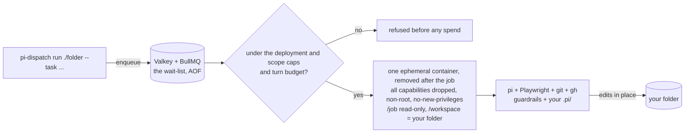

<p align="center">
  
</p>

# pi-dispatch

**Let a coding agent work on your repositories while you are not watching, without surprise bills and
without giving it the keys to your machine.**

[pi](https://github.com/earendil-works/pi) is an open source coding agent that you normally run in a
terminal. pi-dispatch runs it as a background service on your own machine or server. A job starts on a
schedule, from the command line, or when an issue, comment or pull request arrives from a forge (GitHub,
GitLab, Forgejo or Azure DevOps). Each job gets its own locked down container. The agent does one piece
of work
there, pi-dispatch records what it did and what it cost, and the container is thrown away.

pi has no job queue, no concurrency control, no spend limit and, by its own README, no permission
system. pi-dispatch adds exactly that layer and nothing else. It is not another agent to compare with
the one you use. It is the queue, the budget and the box around the pi you already run, steered by the
`.pi/` setup your repo already has.


What you get:

- **A container around every job.** Each job runs non root, with every Linux capability dropped, in a
  container that is deleted afterwards. Its instructions are mounted read only. That container is pi's
  missing permission system. It runs on Docker or Podman ([`docs/backends.md`](docs/backends.md)).
- **Spend limits that apply before anything is spent.** A turn limit per job, daily, weekly and monthly
  caps for the whole deployment, and optional caps per repo or folder. A job over a cap is refused before
  its container starts. The insights page then shows spend per flow, trigger, model, day and repo
  ([`docs/costs.md`](docs/costs.md)).
- **An image you control.** The job image ships git, `gh`, Playwright and Chromium, so a job can build a
  frontend and look at it. Add your own toolchain in [`image/Dockerfile`](image/Dockerfile), or give one
  trigger its own image ([`docs/job-image.md`](docs/job-image.md)).
- **Three ways in, one path.** A CLI command, a cron schedule or a forge event all use the same queue,
  the same container and the same panel ([Triggers](#triggers)).
- **Your repo steers the agent** through pi's own `.pi/` folder: skills (Markdown instruction files the
  agent follows) and a persona. A small safety floor sits under them that the agent cannot remove.

## When to use it

Use pi-dispatch when the work is **recurring or event driven** and you want it to run without you:

- a nightly job that triages new issues, updates a report or tidies a backlog;
- "label an issue `ai` and a fix PR appears", for small everyday fixes;
- a loop that answers review comments on the PRs the agent opened;
- several repos and several such loops sharing one queue, one budget and one panel.

On a forge you stay in control at both ends. A job starts only when someone with write access to the repo
asks for one, with a label, an `@pi` comment or a review. What comes back is a pull request that you
review and merge yourself. pi-dispatch never merges anything, not on green CI, not under any condition
([details](#github-automation)). It removes the terminal babysitting, not you.

For a one off session on your own machine, plain pi is enough. pi-dispatch is for agents that run while
nobody watches the terminal. Two views help you tune what you built: the **graph** shows which triggers
start which flows (the skill a job runs, see [Flows](#flows-the-custom-prompt-a-trigger-runs)) and what
chained to what ([`docs/graph.md`](docs/graph.md)), and **insights** shows
what each of them costs and whether a subscription pays off ([`docs/insights.md`](docs/insights.md)).
`/dispatch insights` writes both into one file that your browser opens from disk:


## Quickstart

You need:

- **Docker**, or **Podman** (rootful through its Docker API, or rootless on Linux with `PI_BACKENDS=podman`;
  which to pick: [Docker or Podman](#docker-or-podman));
- **Node 22.19 or newer**;
- an **API key** for a model provider, which pi uses inside each job (see [Providers and models](#providers-and-models));
- a machine that can run a container runtime all the time (see [Where it can run](#where-it-can-run)).

### From pi (the default route)

If you already use pi, let the console set everything up:

```bash
pi install npm:@edgehero/pi-dispatch-admin   # then, inside pi:  /dispatch
```

With nothing configured, `/dispatch` starts a guided setup. It creates a deployment folder, installs the
exact pi-dispatch version the console expects, runs the same `up` pass shown below, and can install the
worker as a service and a
receiver for forge events. It ends in the admin panel, with an optional first trigger for the repo you
are in. Every step says what it will do and asks first. Nothing is written into your repo, and no
credential passes through a dialog.

### Servers and headless

The same setup as plain commands. No clone needed:

```bash
mkdir my-dispatch && cd my-dispatch
npx @edgehero/pi-dispatch up      # one pass, asks before every container action
#  edit .env and set your provider key (leave it blank if pi already holds your API key)
npx @edgehero/pi-dispatch worker                                               # terminal 1: runs jobs
npx @edgehero/pi-dispatch run ./my-project --task "add type hints" --flow tidy # terminal 2: first job
```

`up` pulls the job image and starts Valkey (the queue's database) with its own password, so no other
account on the host can read the queue. It starts the egress proxy that jobs reach the network through.
It writes the config files (`init` on its own does only that part) and fills in `.env` lines that have no
value yet, without a prompt and without ever overwriting one. Then it runs the `doctor` preflight:


<details>
<summary>What a whole <code>up</code> pass prints</summary>


</details>

A local job edits your folder **in place**, and there is no undo. `pi-dispatch run` refuses a folder with
uncommitted changes unless you pass `--force`. The folder must be the root of a git repository with at
least one commit, and `run` refuses any other folder before it queues anything. A cron trigger's folder is not checked when it fires, so
keep that folder committed yourself.

A clone of this repo (`git clone`, `npm ci`, then `npx pi-dispatch init`, `doctor`, `worker`) is only
needed to **build a custom job image**. Jobs start with `--pull=never`, so pull or build every image first.
A job that names an image the host does not have is refused before it costs anything.

> **Naming heads up.** The published packages are scoped: `@edgehero/pi-dispatch` (the `pi-dispatch`
> command). The bare npm name `pi-dispatch` belongs to an unrelated package (see [License](#license)), so
> outside a checkout always use the scoped name.

## Where it can run

pi-dispatch is a long running worker that starts containers, so it runs on a machine where it can do both:
Node 22.19 or newer beside a container runtime (Docker, or Podman), on the same host.

| Where | Works? |
|---|---|
| A Linux server or VM you control (a VPS, a cloud VM, a home server) | **Yes.** The main target. Run the worker as a service ([Run as a service](#run-as-a-service)). |
| Your own Mac or Windows machine with Docker Desktop | **Yes**, while you are logged in, because Docker Desktop is. |
| Several machines sharing one queue | **Yes** ([`docs/multi-host.md`](docs/multi-host.md)). |
| Serverless and app platforms (Vercel functions, Netlify, Cloudflare Workers, a PaaS without a container runtime) | **No.** There is no container runtime to start jobs in, and nowhere for a worker that never stops. |
| Hosted sandbox services as the place jobs run (Vercel Sandbox, E2B, Modal, Daytona and similar) | **Not yet.** A job runs only on the two backends below. A new venue needs an adapter, and [`docs/backends.md`](docs/backends.md) is the contract it would implement. |
| A Docker or Podman daemon on another machine (`DOCKER_HOST=ssh://...`) | **No.** Job files are mounted from the worker's own disk, which that machine does not have, and it would receive every job's provider key and forge token. |

Only the receiver needs to be reachable from the internet, and only for webhooks. Behind a firewall, use
the receiver's `poll` mode instead, which needs no public URL ([`docs/github.md`](docs/github.md)).

### Docker or Podman

Jobs run in one of two backends, both on the worker's own host:

- **`local`**, the default: the Docker daemon (or rootful Podman through its Docker API). Easiest to set up,
  and the only choice on macOS and Windows. The worker needs access to the daemon's socket, and that
  access is equivalent to root on the host.
- **`podman`**: rootless Podman, as the worker's own account, on Linux. No daemon runs as root, and the
  worker needs no root equivalent group. Each job runs as the worker's own uid in that account's own
  container store, so a container escape lands in an unprivileged account. Valkey, the egress proxy and
  the worker run as systemd user units. Pick it for a shared or security sensitive Linux server.

To use rootless Podman: run the worker as an ordinary account (not root) with its own subordinate ids,
turn on linger (`sudo loginctl enable-linger <account>`) so its services run without a login, set
`PI_BACKENDS=podman` in `.env`, pull the job image with `podman`, then run `pi-dispatch up`,
`pi-dispatch service install` and `pi-dispatch doctor --live`. The full, measured setup, and what is
refused (Podman machine on macOS and Windows, rootful or remote Podman on this venue, a root worker), is in
[`docs/podman.md`](docs/podman.md).

## Providers and models

**pi-dispatch itself needs no AI key.** The queue, the caps, the containers and the panel run no model. The
key is for pi, the agent that runs inside each job, and the worker hands it to each job container. pi-dispatch
works with most providers pi supports: Anthropic, OpenAI, Google, Groq and about thirty more
(the exceptions are below). Pick the default in `.env`:

```bash
PI_PROVIDER=anthropic
PI_MODEL=claude-sonnet-4-5-20250929   # a dated id keeps cost predictable
ANTHROPIC_API_KEY=...
```

Override them for one job with `--provider` and `--model`. The name of the key variable is pi's, not
ours: the worker asks pi which variable your provider reads (`GEMINI_API_KEY` for Google, for example),
and `doctor` checks that it is set.

- **Already logged into pi with an API key?** Leave the key blank. The worker reads it from
  `~/.pi/agent/auth.json` on the host and passes it to each job. Set `PI_AUTH_FROM_PI=0` to turn that off.
- **Not supported from your pi login:** an OAuth or subscription login, or a stored key written as
  `!command` or `$VAR`. They expire or need a shell, and a service needs an API key with a spend limit.
  These are refused with a reason before anything is spent. An `ANTHROPIC_OAUTH_TOKEN` or
  `ANTHROPIC_AUTH_TOKEN` set in the environment is still sent to the job, and `doctor` only warns about
  it: pi reads either one before `ANTHROPIC_API_KEY`.
- **Not supported at all:** providers that do not use a single key variable (an AWS profile for Bedrock,
  for example). The job is refused before anything is spent.
- **A custom provider** goes in your pi `models.json`, staged with `import-pi`. As a job's main provider it
  runs when a local model server that takes no key serves every one of its models
  ([`docs/egress.md`, "Local model servers"](docs/egress.md#local-model-servers)). For any other model the
  agent uses, name its key in `PI_FORWARD_ENV` ([`docs/global-pi-overlay.md`](docs/global-pi-overlay.md)).

## Triggers

**A trigger is what starts a job.** All standing triggers live in one `triggers.json`. The worker reads
it live for cron jobs, the receiver reads it live for forge events, and the panel can edit it. Each entry
is an `{ on, run }` pair: **`on` says what fires it**, and **`run` says what it runs**.

```jsonc
{ "triggers": [
  { "on": { "type": "cron", "id": "nightly", "pattern": "0 3 * * *" },
    "run": { "kind": "local", "folder": "/srv/site", "flow": "tidy", "task": "run the nightly tidy" } },
  { "on": { "type": "label", "any": ["pi:frontend"] },              "run": { "kind": "github", "flow": "frontend-fix" } },
  { "on": { "type": "comment", "phrase": "@pi" },                   "run": { "kind": "github", "flow": "fix" } },
  { "on": { "type": "pull_request", "action": ["labeled"], "any": ["pi:review"] }, "run": { "kind": "github", "flow": "review" } },
  { "on": { "type": "label", "any": ["pi:fix"] },                   "run": { "kind": "gitlab", "flow": "fix" } }
] }
```

### The five trigger types: what fires each one, and what it runs

| `on.type` | Fires when | The agent's task |
|---|---|---|
| `cron` | your schedule | `run.task` from the file |
| `label` | a label is added to an issue (or an Azure work item) | the issue title and body |
| `comment` | a comment contains your phrase, such as `@pi` | the comment plus the issue |
| `pull_request` | a PR or MR event, a submitted GitHub review, or a close | the PR title and body |
| `issue` | an issue closes | the issue title and body |

`run` names either a `flow` (a skill in the repo, see [Flows](#flows-the-custom-prompt-a-trigger-runs)) or
a registered pi `command`. **Who may fire a trigger is decided by your forge, not by pi-dispatch.** On
GitHub only collaborators can add a label, so the label is the approval. GitLab, Forgejo and Azure check
the actor's permission through their APIs, because a label proves less there. [`SECURITY.md`](SECURITY.md)
states each forge's rule. Every field, each forge's action words and the review trigger's caveats are in
[`docs/triggers.md`](docs/triggers.md).

### Close triggers and one-shots

A close can run a job exactly once: `number` narrows the rule to one issue or PR, and `once: true` spends
it after one run. How spending works, and how to re-arm a rule:
[`docs/triggers.md`](docs/triggers.md#close-triggers-and-one-shots).

### Optional `run` fields

A trigger can have its own image, vault secrets, removed tools, standing instructions, replicas, a resumed
session or a wait condition. Each one is a file edit only, never a panel key or an AI tool, because each
changes what code runs or what it costs: [`docs/triggers.md`](docs/triggers.md#optional-run-fields).

### Quiet hours

Pause a repo or folder between set times, by weekday and timezone. A paused job waits and spends nothing.
Manage them with `w` in the panel ([`docs/pause-windows.md`](docs/pause-windows.md)).

### Scoped limits

Cap how many jobs a repo or folder may run per day, week or month, and how many at once. Over a cap the
job is refused before any spend; over the concurrency ceiling it waits. Local jobs also have a fixed guard:
one job per folder at a time, because two agents editing one working tree race each other with no gate
and no undo. The guard lives in the worker process, and one worker per container daemon is the supported
setup. Version 2 of the file adds dollar caps per day, week and month for a repo, a folder or a model.
Manage limits with `m` in the panel ([`docs/scoped-limits.md`](docs/scoped-limits.md)).

### Waiting on a condition

`run.waitFor` holds a job in the queue, unstarted and unbilled, until a time passes or your own check
script says go. The script gets only the job's target id, never a title or a body
([`docs/wait-for.md`](docs/wait-for.md)).

### More than one machine

Several machines can share one queue, one budget and one panel once each worker has a name
(`PI_WORKER_NAME`). Do not share the sandbox directory between them
([`docs/multi-host.md`](docs/multi-host.md) says why).

## Flows: the custom prompt a trigger runs

A **flow** is a pi skill, a Markdown instruction file, committed to the target repo at
`.pi/skills/<flow>/SKILL.md`. That file is the prompt. A trigger only names the flow, so each repo can
define the same flow name its own way. The [`examples/`](examples/) folder has a small one to start from.
A skill ships with its scripts and references, within size limits
([Flows in detail](docs/triggers.md#flows-in-detail)).

```markdown
<!-- .pi/skills/tidy/SKILL.md -->
---
name: tidy
description: Format, fix lint, and tighten types across the repo.
ai-trigger: allow        # opt-in for AI-INITIATED runs only (the dispatch_run tool, job chaining). Default deny.
---

Run the formatter and linter and fix what they report; tighten obvious type holes.
Keep the diff minimal and open a PR titled "tidy: <what changed>". Do not change behavior.
```

The flow holds the standing instructions. The **task** is the one off request: your `--task`, a
trigger's `task`, or the issue or comment text. Flows are read from the **default branch**, so a flow
must be merged before a trigger can use it. That merge is the repo's consent.

`ai-trigger` only decides **which flows a model may start**: through the `dispatch_run` tool, or by job
chaining (a finished job asking for a follow up job). It does not decide who may fire a job. A cron or
forge trigger in your reviewed
`triggers.json` runs its flow either way, because a human approved that pairing by writing the file.
Leaving the line out does **not** stop a label or comment trigger.

### Multi-stage workflows, and third-party pi extensions

A skill can call other skills, so the simplest workflow is that chain running inside one job. For more
structure, stage pi extensions into the deployment with `pi-dispatch import-pi --with-packages`. They load
in every job at an exact pinned version, can be withheld per trigger with `"packages": false`, and never
shadow your repo's own skills. One trigger is still one job with one budget, so budget for the whole
chain. Where a workflow keeps its state differs between cron and forge jobs:
[`docs/workflows.md`](docs/workflows.md) and
[`docs/triggers.md`](docs/triggers.md#multi-stage-workflows-and-third-party-pi-extensions).

## What runs, and what protects you


```mermaid
flowchart LR
  CLI["pi-dispatch run ./folder --task ..."] -->|enqueue| Q[("Valkey + BullMQ<br/>the wait-list, AOF")]
  Q --> B{"under the deployment and scope caps<br/>and turn budget?"}
  B -->|no| STOP["refused before any spend"]
  B -->|yes| C["one ephemeral container, removed after the job<br/>all capabilities dropped, non-root, no-new-privileges<br/>/job read-only, /workspace = your folder"]
  C --> PI["pi + Playwright + git + gh<br/>guardrails + your .pi/"]
  PI -->|"edits in place"| F[("your folder")]
```

Every trigger takes this path: spend is checked before the container starts, and nothing is dropped.
Read [`SECURITY.md`](SECURITY.md) before you rely on it. It says plainly what is and is not defended.

- **Network egress is denied by default.** Each job gets its own network behind an allowlist proxy. A
  job the policy cannot serve is refused before it spends. The allowed hosts are yours to list: pi-dispatch
  cannot know what your flows need to reach, so read [`docs/egress.md`](docs/egress.md) first.
- **Token and cost records cover the whole job**, including subagent sessions. The per job token budget is
  enforced against that same total.
- **The container runtime is a named backend** that declares what it guarantees.
  [`docs/backends.md`](docs/backends.md) is the contract. `pi-dispatch doctor` prints the declaration.
  `pi-dispatch doctor --live` reads eight of those properties back from short lived real containers on
  your host. [`docs/podman.md`](docs/podman.md) says what each Podman setup gets and which ones are refused.

### What is inside the container while a job runs

Two credentials go in as environment values. **The agent can read both.** The runner starts the
agent session in its own process, so `process.env` is the agent's environment. The guardrails tell the
agent never to print or send them, but that is prompt text, not enforcement.

- **The provider key**, under your provider's variable name. It cannot be scoped, because the agent
  needs it to work. Bound it with a **spend limit at your provider** instead. Set one. A host that holds
  both `ANTHROPIC_OAUTH_TOKEN` (or `ANTHROPIC_AUTH_TOKEN`) and `ANTHROPIC_API_KEY` sends both.
- **The forge token**, bounded by the auth source you chose. On GitHub that is a one hour token for one
  repo with the App, or **your whole login, full scope and never expiring**, with the default `gh`
  source (`GITHUB_AUTH_SOURCE`). On the other forges it is the token you made, for as long as it is valid.
- **Anything you list in `PI_FORWARD_ENV`**, the only channel for extra variables (a custom provider's
  key, say). Same exposure.

The limit is on the damage, not on the leak. [`SECURITY.md`](SECURITY.md) states all of it, including
the case this design does not defend. None of these have to sit in a file: the worker reads its
environment and parses no `.env` itself, so a secrets manager fits in directly
([`docs/secrets.md`](docs/secrets.md)).

## Reuse your existing pi setup

Give every job your host pi setup (custom models, global skills, a persona), layered under each repo's
own `.pi/`. The repo wins on any conflict:

```bash
pi-dispatch import-pi   # stage a credential-free copy of ~/.pi/agent into ./pi-global
                        # then set PI_GLOBAL_PI_DIR in .env; doctor checks it holds no credential
```

- **Credentials never enter this copy.** `import-pi` refuses a `models.json` with a key written in it and
  never copies `auth.json` ([`docs/global-pi-overlay.md`](docs/global-pi-overlay.md)).
- **Third party pi packages are pinned once** at the version your host has (always `--ignore-scripts`)
  and can be declined per trigger ([`docs/workflows.md`](docs/workflows.md)).
- **What a repo declares is never installed.** A repo's own `.pi/extensions` do run, because the checkout
  is the default branch and merging is the gate. But nothing installs packages because a repo asks,
  since that would put third party install code next to a live forge token ([`SECURITY.md`](SECURITY.md)).
- **Sessions can continue.** `"resume": true` makes follow up jobs continue the session that opened the
  pull request. It saves the full transcript to disk, which is a real disclosure: read
  [`docs/sessions.md`](docs/sessions.md) before you turn it on.

## Run as a service

```bash
pi-dispatch service render    # show the unit it would install, with the real paths
pi-dispatch service install   # LaunchAgent (macOS), systemctl --user (Linux), nssm (Windows, a machine service)
pi-dispatch service status    # which unit exists, where, and whether it runs
pi-dispatch service restart --drain   # pause, wait for running jobs, restart, resume
```

`install` renders the [`deploy/`](deploy/) templates without sudo (`--system` on Linux prints the sudo
commands instead). A unit uses the folder you run `install` from as its working directory and reads that
folder's `.env`. `--receiver` installs the receiver's unit instead of the worker's (the receiver package
must be installed
beside the worker), and `--env-setup <path>` wraps the worker in
your secrets manager's setup script ([`docs/secrets.md`](docs/secrets.md)). On rootless Podman
(`PI_BACKENDS=podman`) it also installs Valkey, the egress proxy and the proxy's network keeper as systemd
units (Podman's Quadlet format), and `up` offers the same ([`docs/podman.md`](docs/podman.md)). Run one
worker per container daemon. `install` refuses a second worker unit in the other scope, because each
worker's startup cleanup stops every job container it did not start, including the other worker's live
jobs.

On Windows, `service render` prints the nssm commands it would run, so you can check them first:


Two limits. On macOS and Windows the service runs only while you are logged in, because Docker Desktop
does too. A policy refusal (exit 2) never restarts the service, on any OS, so no supervisor keeps retrying
against a paid provider.

Steer the running worker from any terminal:

- `pi-dispatch pause` stops taking new jobs. It is stored in the queue, so it survives restarts. Jobs
  still queue up and wait. `pi-dispatch resume` takes jobs again, and `pi-dispatch status` prints counts.
- `pi-dispatch cancel <jobId>` stops one job in any state. A queued or held job is removed. A running job
  is stopped on whichever host runs it, and its run record says `operator-cancel`. If no reachable worker
  owns the job (its host is down, or its worker is older than this command), the command says so and
  changes nothing. Like `pause`, it reads only `VALKEY_URL`, so a
  broken forge setting cannot stand between you and the stop ([`docs/wait-for.md`](docs/wait-for.md)
  covers held jobs and retries).

## The admin panel

The dashboard at the top of this page is a **pi extension**. It loads into your own pi session: no
daemon, no web app, no network port. Install it with `pi install npm:@edgehero/pi-dispatch-admin` and
type `/dispatch`. If no deployment exists yet, `/dispatch setup` builds one (see the
[Quickstart](#from-pi-the-default-route)). It writes a small pointer file
(`~/.pi/agent/pi-dispatch-deployment.json`, paths only, never credentials) so the panel finds the
deployment from any directory, and your own env vars always win over it. When the deployed version falls
behind the console's, a notice points you back at `/dispatch setup`.

In the panel:

| Key | Does |
|---|---|
| `↑↓` `Enter` | open a trigger or a run |
| `a` | add a trigger (checked, saved atomically, reloaded live) |
| `Enter` then `e` `x` | change a trigger's flow, delete it (asks first) |
| `p` `r` | pause and resume the queue |
| `s` | set a limit |
| `w` `m` | manage quiet hours, manage scoped limits |
| `h` `f` | show held jobs, show failed jobs |
| `l` `o` | open the running job's live log, change the runs sort |
| `x` on a running job | cancel it (asks first) |
| `i` | open the insights page |

`Enter` on a run opens its full record, and `b` there reopens its workspace:


The same data is there as plain commands, all local, with no model involved: `/dispatch status | runs |
logs | budget | triggers | insights | run | pause | resume | set | unset | settings | setup | secrets`.


The insights page also draws the trigger and flow topology ([`docs/graph.md`](docs/graph.md)):


### Operating pi-dispatch from your AI

The package also ships the `operate-pi-dispatch` **skill**, so you can ask your assistant in plain words:
"raise the daily cap to 30", "cap acme/web at ten runs a day", "add a nightly tidy trigger for /srv/site".
Reading needs no confirmation. Every config change asks **you** to confirm in a prompt the model cannot
answer, and is refused when no operator is present. So a prompt injected session cannot raise your cap or
add a paid trigger. One tool is deliberately not money safe: `dispatch_run` queues a paid run without
asking. Six separate limits bound it instead: a folder allowlist, the committed `ai-trigger: allow`
opt in, the dirty tree refusal, no spend settings, a rate limit and the daily cap. Raw job logs show in
the panel only and never reach the model.

## GitHub automation

Label an issue, and a container works on a fresh clone, opens a PR and comments back.

- **Only a collaborator's label, `@pi` comment or formal review starts a job.** The label is the approval.
  A PR from a stranger's fork never starts a job on its own. A review is gated on the **reviewer**, so a
  collaborator reviewing that fork PR does start one.
- **The token can merge.** GitHub puts push and merge behind the same permission, so under every auth
  source the job's token could merge. pi-dispatch never does, and **branch protection on your default
  branch is the real control**. The worker refuses a repo without it, before any spend.
- **Which token a job holds depends on the auth source.** The GitHub App mints one per job, for one repo,
  valid for an hour. The default `gh` source forwards **your own login, full scope and never expiring**,
  into every job that carries a token, and `pi-dispatch doctor` warns about that. A fine grained PAT has
  the expiry you set.
- **The checkout is always the base repo at its default branch**, never a PR branch. A commit that lands
  on your default branch can run code in a job. Issue and comment text never can; it stays data.

`pi-dispatch setup github` creates a GitHub App for you in one browser click, shows every `.env` line
before you agree, and never prints a secret. Then pick one of **three ways to run the trigger edge** (the
part that takes in forge events): the webhook receiver on the host, the receiver in a container, or the
receiver's `poll` mode, which needs no public URL at all. How each works: [`docs/github.md`](docs/github.md).

## Other forges

The same machinery, with a setup doc per forge. These forges have one auth source each, a token you
create, so `GITLAB_AUTH_SOURCE`, `FORGEJO_AUTH_SOURCE` and `AZURE_AUTH_SOURCE` accept only `pat`. Once that
forge's token is set, setting one to `app` gets a clear refusal at boot rather than being quietly ignored.

- **GitLab** ([`docs/gitlab.md`](docs/gitlab.md)): webhook at `/gitlab`. You need a project token with
  `api` scope. Every trigger checks that the person who fired it is Developer or higher. Needs GitLab 17.4
  or newer for dedup that survives retries. Self hosted works through `GITLAB_URL`.
- **Forgejo and Gitea** ([`docs/forgejo.md`](docs/forgejo.md)): webhook at `/forgejo`. Every trigger checks
  that the person has permission on that repository.
- **Azure DevOps** ([`docs/azure-devops.md`](docs/azure-devops.md)): a Service Hook at `/azure`. It is the
  weakest transport of the four (no HMAC signature, no signed timestamp), and the doc explains what that
  means. It needs a dedicated identity, `run.repository` on triggers, and its own job image
  (`image/Dockerfile.azure`).

## Run history, costs, and re-opening a run

Every job writes a durable record with ids only, never issue or comment text. Raw logs are opt in
(`PI_CAPTURE_JOB_LOGS=1`) and stay on the host. Records and panel settings live in `~/.pi-dispatch` by
default, outside any repo and outside the temp folder ([`docs/backup.md`](docs/backup.md)). Each record
holds a usage ledger per model, which the insights page prices. Tell it what your subscriptions cost in
`subscriptions.json` and it shows whether they save money. A zero-rate run with no declared plan reads
`$0 (unrated)`, never "free" ([`docs/costs.md`](docs/costs.md)).

A finished run's workspace is kept for 24 hours by default. You can reopen it:

```bash
pi-dispatch sandbox gh-12345 --publish 3000   # a fresh container on that run's workspace, no credentials
```

You get the same image and isolation, but no token, no provider key and no agent. You are the one
working. A kept workspace holds the run's clone and its issue text, so read
[`docs/sandbox.md`](docs/sandbox.md)
before you keep them longer. When a paid forge job fails, the worker comments on its issue or PR. You can set
`PI_ON_FAILURE` to run your own hook ([`docs/notifications.md`](docs/notifications.md)).

## How it compares

**vs the Claude Code GitHub Action**: for GitHub only automation the
[action](https://github.com/anthropics/claude-code-action) handles label triggered issues with a tenth of
the setup. pi-dispatch is for running pi on your own hardware with a real queue, a container boundary,
and flows against **local folders** as well as repos.

**vs hosted routines and `/loop`**: for "run a prompt on a schedule" they are simpler, with nothing to
host. pi-dispatch's cron trigger is for recurring work that needs a project's exact toolchain, or the
built in Playwright and Chromium that let a flow build a frontend and check how it renders.

## Status

Everything on this page is built and running, on all four forges and on Docker and Podman.

The design lives in [`specs/`](specs/), and the specs are the source of truth, not a summary of the code.
Start with [`specs/constitution.md`](specs/constitution.md) for the rules that never bend,
[`specs/design.md`](specs/design.md) for the decisions and what was rejected, and
[`specs/interfaces.md`](specs/interfaces.md) for the file and container contracts. Every spec file ends
with a revision history, corrections included.

Working on this repo with an AI agent? [`CLAUDE.md`](CLAUDE.md) is the short version of what matters here.

## Contributing

PRs welcome. Sign off your commits with `git commit -s`: this project uses the
[DCO](https://developercertificate.org/), not a CLA. If you change how the code behaves, the spec changes
with it. `specs/` is the source of truth. A PR that breaks a `CONST-*` entry will be asked to justify
changing the rule first, not the code.

## License

MIT. See [LICENSE](LICENSE). Built on [pi](https://github.com/earendil-works/pi) by Mario Zechner, which
does the actual hard part.

> **Not affiliated with** the unrelated npm package `pi-dispatch`, a pi extension for rotating ChatGPT
> Codex OAuth accounts. Same name, different thing. This project publishes scoped packages only:
> [`@edgehero/pi-dispatch`](https://www.npmjs.com/package/@edgehero/pi-dispatch) (worker and CLI),
> [`@edgehero/pi-dispatch-receiver`](https://www.npmjs.com/package/@edgehero/pi-dispatch-receiver), and
> [`@edgehero/pi-dispatch-admin`](https://www.npmjs.com/package/@edgehero/pi-dispatch-admin) (the
> console). The bare name is theirs.
