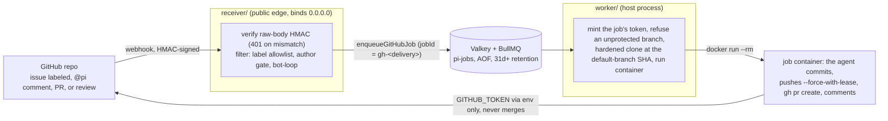

# GitHub automation

This page is the detail behind the [GitHub automation](../README.md#github-automation) section of the README.

Label an issue, and a container works it on a fresh clone, opens a PR, and comments back:

## Who can start a job, and what the token can do

- Only a collaborator's label, `@pi` comment or formal review starts a job. The label is the approval
  step. PR triggers (label, comment, auto on open/update, or a submitted review) gate the auto path on
  the PR author being a collaborator. A fork PR from a stranger never auto-fires. A review trigger gates
  on the **reviewer** instead. This way a collaborator reviewing that same fork PR can fire it.
- What bounds the per-job token depends on which auth source you run. The App creates one scoped to a
  single repository. It expires in an hour. The default `gh` source forwards your own login into every
  token-carrying job. It has full scope and does not expire. This is what `pi-dispatch doctor` warns
  about. Under every source it *can* merge, because GitHub gates push and merge behind the same scope.
  **Branch protection on your default branch is the real control.** The worker refuses an unprotected
  repo before any spend.
- The checkout is always the base repo at its default-branch SHA. It is never a PR branch. Landing a
  commit on your default branch is enough to run code in a job container. Issue and comment text never
  runs code. It stays data.

## Credentials in one click

`pi-dispatch setup github` runs GitHub's App Manifest flow against your own
loopback. One browser click creates the App id, private key and webhook secret. Every `.env` line is shown
before one consent. The key lands with mode 0600. No secret is ever printed. The App is the strongest
auth source (per-repo one-hour tokens). A fine-grained PAT carries an expiry you set. `gh` carries
neither (`GITHUB_AUTH_SOURCE`).

## Three ways to run the trigger edge

Pick one, or let `/dispatch setup` walk you through the choice, which it offers right after the
credentials step:

1. **Webhook receiver on the host** (lowest latency): Run `npx @edgehero/pi-dispatch-receiver` from your
   deployment
   folder. Or run `pi-dispatch service install --receiver` to run it as a user-level service. Your reverse
   proxy or tunnel does the public exposure.
2. **Webhook receiver in a container**: Run `docker compose --env-file .env -f deploy/docker-compose.yml
   --profile receiver up -d`. This runs the prebuilt
   [`ghcr.io/edgehero/pi-dispatch-receiver`](https://github.com/edgehero/pi-dispatch/pkgs/container/pi-dispatch-receiver)
   beside Valkey. It needs `deploy/docker-compose.yml`, which a clone carries and `/dispatch setup` copies in
   when you choose the receiver container. Triggers are mounted read-only. No docker socket goes
   anywhere. In a folder `/dispatch
   setup` built, the
   compose file sits in `deploy/` of that folder. The command names the folder's own project with `-p <folder
   name>` (lower case, only letters, digits, `_` and `-`). Where `pi-dispatch up` had already started the
   deployment's Valkey, add `-f deploy/docker-compose.valkey.yml`. This gives compose's Valkey that same
   volume, so the worker and the receiver share one queue. Run it the same way afterwards. Setup hands
   over only a
   `pi-dispatch-valkey` that is this folder's. It refuses while another deployment's Valkey uses that volume.
3. **No public URL at all**: Run `pi-dispatch-receiver poll` to fetch issue events, comments and PRs over TLS
   with your own credential. It uses conditional requests, nearly free against the rate limit. Same
   gates, same
   queue, about 60 seconds of latency, zero public surface. Pair with `setup github --no-webhook`. A
   fresh poller starts from now and never replays old labels. Name the repositories in `POLL_REPOS`. Or
   run under `GITHUB_AUTH_SOURCE=app` and let the App installation name them
   ([`docs/polling.md`](polling.md)).
